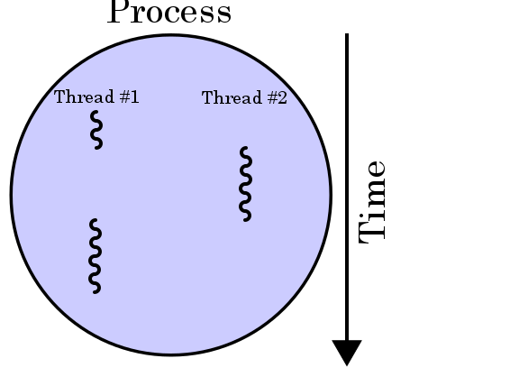

# Asynchronous Programming in C# and .NET Core

When a computer is running a program, the operating system or the application allocates a group of resources; known as a thread; to run the application code.

In synchronous programming, all the code from on application is running on a single thread. Therefore, code has to execute synchronously which means code is executed in a one action at a time. One operation has to finish before the processor moves on to execute the next operation. That means if one operation is taking a long time, the program will freeze and stop waiting for it to finish before it moves to the next operation.

An asynchronous operation is an operation that runs on a separate thread that gets initiated from another thread. The thread that initiates an asynchronous operation does not need to wait for that operation to complete before it can continue. In that sense, resources can be allocated to other tasks that can be executed in the meantime.

## Why Use Asynchronous Programming

Asynchronous programming makes the best and most efficient utilization of the machine resources when it comes to having long running operations in an application. For a UI application, Asynchronous programming makes the application responsive because the UI thread is not blocked by a CPU or I/O heavy operation which makes it more interactive and user friendly. Asynchronous programming also takes advantage of parallel computing which is supported in most of today's machines. This helps programmers write parallel processing applications easily without having to write complicated code that is hard to maintain.

## When to use Asynchronous Programming

Asynchronous code is best used for long running operations. Those operations can be CPU bound or I/O bound operations. Examples of long running operations are:

- I/O operations that include Network requests for data retrieval
- CPU heavy operations like scientific calculations using huge data sets
- I/O operations like disk access operations including reading and writing to disks

If you have any I/O-bound needs (such as requesting data from a network or accessing a database), you'll want to utilize asynchronous programming so that your program UI does not freeze waiting for this operation to finish.

## What applications are best candidates for asynchronous programming ?

- **Desktop User Interface Applications** - a desktop UI application is an application that is expected to be interactive, users should be able to interact and communicate with the various pieces of the application UI mostly at all times. Nothing is worse for an UI application than a frozen control that the user is unable to interact with because of a long running network operation like a web service call. The time spent waiting for information to travel across the network is blocking the UI resources and thus the application appears to be frozen or dead.
  Desktop / UI modern frameworks give special precedence to the thread that uses the UI. Async code is very important for these technologies to build better UI applications. Examples of UI technologies that use asynchronous programming are:

Windows Forms (WinForms)
Windows Presentation Foundation (WPF)
Universal Windows Platform (UWP)

- **Web Server Applications** - a web server application does not deal with UI but often times, it needs to run remote database queries or run some calculations on large amounts of data to generate a data analysis report. Using Asynchronous programming for these tasks allows the server code to do the task efficiently specially that web servers are usually handling multiple requests from multiple clients at the same time. Asynchronous programming helps avoid situations where threads are simply waiting to do something while the rest of the application is getting overwhelmed by clients requests resulting in less than ideal performance as well as delayed responsiveness to clients requests.

## When not to use Asynchronous Programming

There are problems that asynchronous code does not solve. There are also problems that Asynchronous code can cause. For example:

1. Asynchronous code does not automatically improve performance. If a network task takes a certain amount of time, asynchronous code is not going to change that. In fact, there is some amount of (small) overhead for the framework managing the process. Rather, asynchronous code helps manage resources more efficiently.
2. Using Asynchronous code imposes an overhead on the system. When threads are used, the system needs a way to manage them like thread saving, scheduling, listening, locking, resuming, ...etc. There are two types of overhead that exist when using threads, memory overhead which every thread reserves from a machine's virtual memory when initiated, and a scheduler overhead which is the way the operating system uses to manage choosing which thread should be executed on which CPU and when. These overheads can slow down the entire system if threads are excessively used.
3. If you don't have a desktop / UI application, or your code is not network- or I/O-bound, you won't see much benefit.
4. If your application is CPU-bound (it is slowing down because of heavy compute processes), multi-threading / task-based asynchrony is a better solution.

Asynchronous operations are closely related to tasks. The .NET Framework support for `async` programming makes it easier to perform asynchronous operations by transparently creating new tasks and coordinating their actions on your behalf. In particular, the built-in `async` and await keywords are the heart of `async` programming in C#. They enable you to invoke an asynchronous operation and wait for the result within a single method, without blocking the thread.
Asynchronous methods that you define by using `async` and await are referred to as `async` methods.

```C#
// Three things to note in the signature:
//  - The method has an async modifier.
//  - The return type is Task or Task<T>.
//  Here, it is Task<int> because the return statement returns an integer.
//  - The method name ends in "Async."
async Task<int> AccessTheWebAsync()
{
	// You need to add a reference to System.Net.Http to declare client.
	HttpClient client = new HttpClient();
	// GetStringAsync returns a Task<string>. That means that when you await the task you'll get a string (urlContents).

	Task<string> getStringTask = client.GetStringAsync("http://msdn.microsoft.com");
	// You can do work here that doesn't rely on the string from GetStringAsync.
	DoIndependentWork();
	// The await operator suspends AccessTheWebAsync.
	//  - AccessTheWebAsync can't continue until getStringTask is complete.
	//  - Meanwhile, control returns to the caller of AccessTheWebAsync.
	//  - Control resumes here when getStringTask is complete.
	//  - The await operator then retrieves the string result from getStringTask.
	string urlContents = await getStringTask;
	// The return statement specifies an integer result.
	// Any methods that are awaiting AccessTheWebAsync retrieve the length value.
	return urlContents.Length;
}

```

## What Makes an async method ?

- The method signature includes an `async` modifier
- The name of an async method, by convention ends with an "Async" suffix
- The return type is one of the following types
  - `Task<TResult>`
  - `Task`
  - `void`
- The method includes at least one await expression

which marks a point where the method can't continue until the awaited asynchronous operation is complete. In the meantime, the method is suspended, and control returns to the method's caller.

As mentioned, the core of asynchronous programming are the Task and Task<T> objects, which model asynchronous operations. They are supported by the async and await keywords. In C#, a Task object can be thought of as an ongoing operation. An object of the subclass Task<T> is an operation that will have a result of type T at some point in the future. It is like a promise of a T when the awaited operation completes.

The model is fairly simple in most cases:

**For I/O-bound code** - you await an operation which returns a `Task` or `Task<T>` inside of an async method
**For CPU-bound code** - you await an operation which is started on a background thread with the Task.Run method.

## Async method support in .NET Classes

The .NET Framework 4.5 or higher and .NET Core contain many members that work with async and await. You can recognize them by the “Async” suffix that’s appended to the member name, and by their return type of Task or Task<TResult>. For example, the System.IO.Stream class contains methods such as CopyToAsync, ReadAsync, and WriteAsync alongside the synchronous methods CopyTo, Read, and Write.

The Windows Runtime also contains many methods that you can use with async and await in Windows apps.

The .Net Core framework has a rich support for async methods. Types in the .Net Core framework that have support for the async methods include

### Network-oriented classes with async methods

1. **HttpClient**: Provides a base class for sending HTTP requests and receiving HTTP responses from a resource identified by a URI
2. **WebClient**: provides common methods for sending data to and receiving data from a resource identified by a URI

### Files I/O -oriented classes with async methods

1. **StreamWriter**: provides methods for writing characters to a stream in a particular encoding
2. **StreamReader**: this class allows reading of characters from a byte stream in a particular encoding
3. **XmlReader**: a class that represents a reader that provides a fast, non-cached, forward-only access to XML data.

## Characteristics of an Async Method in .NET Core

1. **Use the async keyword in the method declaration**

Use the `async` modifier to specify that a method, lambda expression or anonymous method is asynchronous.

```C#
public async Task<int> ExampleMethodAsync()
{
    // . . . .
}
```

2. **Use the await keyword in the code calling an asynchronous process/method**

The await operator is applied to a task in an asynchronous method to insert a suspension point in the execution of the method until the awaited task completes. The task represents ongoing work or a promise. It is not until you await on an async method call that it is actually executing. When you call an `async` method without using await, you only receive a promise (Task) that you can await on later. This task will give you the promised return type after it completes. In C# syntax, await acts as a unary operator. It is placed to the left of an expression and means to wait for that expression asynchronously with no blocking. If you apply await to a Task<T>, it becomes an await expression, and the whole expression has type T. That means you can assign the result of awaiting to a variable of type T and use it in the rest of the method.

`await` can only be used in an `async` method modified by the `async` keyword.

If await is applied to the result of a method call that returns a `Task<TResult>`, then the type of the `await` expression is `TResult`. If `await` is applied to the result of a method call that returns a `Task`, then the type of the `await` expression is `void`.

```C#

// await keyword used with a method that returns a Task<TResult>.
TResult result = await AsyncMethodThatReturnsTaskTResult();

// await keyword used with a method that returns a Task.
await AsyncMethodThatReturnsTask();

// await keyword used with a method that returns a ValueTask<TResult>.
TResult result = await AsyncMethodThatReturnsValueTaskTResult();

```

3. **Use one of the correct return types in the `async` method to get results**

Return types for an `async` method need to be one of the following

- `Task<TResult>` if your method has a return statement in which the operand has type TResult.
- `Task` if your method has no return statement or has a return statement with no operand.
- `void` if you're writing an `async` event handler.
- Any other type that has a `GetAwaiter` method (starting with C# 7).

4. **Adding the “Async” suffix at the end of the method name. This is not required but is considered a convention for writing `async` methods in C#.**

```C#
public async Task<int> ExampleMethodAsync()
{
    // . . . .
}
```

5. **Include at least one await expression in the async method code.**

The marked async method can use await to designate suspension points. The await operator tells the compiler that the async method can't continue past that point until the awaited asynchronous process is complete. In the meantime, control returns to the caller of the async method. The suspension of an async method at an await exression doesn't constitute an exit from the method, and finally blocks don't run.

```C#
public async Task<int> ExampleMethodAsync()
{
	//some code
	string pageContents = await client.GetStringAsync(uri);
	//some more code
	return pageContents.Length;
}

```

Although an async method typically contains one or more occurrences of an await operator, the absence of await expression doesn't cause a compile error. If an async method doesn't use an await operator to mark a suspension point, the method executes as a synchronous method does, despite the async modifier. The compiler issues a warning for such methods.

## Creating Async Methods

### When to use Async methods in your code

It may seem like using async programming in all your code is a good idea. Well, this is not correct. Async programming is best usefult in certain scenarios and use cases. Consider the following questions during your code design to decide whether async is the best practice for your application

1. Will your code be waiting for something to happen ? For instance, will it be integrating with web services?
2. Are you leveraging a library/method that is already asynchronous
3. Is your code likely to have multiple simultaneous users ?
4. Are you developing an application with a desktop/UI technology and responiveness is a key for the best user experience.

If the answer is yes to any of the questions above, then you may consider asynchronous programming.

If you choose to use asynchronous programming then your next step is to identify the entry point of asynchronous code. This means identifying where the async methods should start and where to await on calls. For example, consider where a web service will be called in the code and when (when a user clicks on a button for example, or web server receives a request from a client).

Another strategy is to start with synchronous code with network- or I/O bound code. Then work on converting your synchronous code to asynchronous code by doing the following:

Add await keyword for calling code.
Add async keyword for the method doing the await call.
Adjust return types.
Adjust calling methods on the call stack, to also be asynchronous.

## Understanding what is happening

In async methods, you use the proper keywords and types to indicate what you want to do, and the compiler does the rest, including keeping track of what must happen when control returns to an await point in a suspended method.

The .NET Framework simplifies many operations to allow methods to be async. It does a lot of work that you do not have to write code for unless you were writing asynchronous code manually. Examples of these operations are :

1. Saving state
2. Saving the parameters of your method
3. Saving local variables; any other variables in scope

The .NET Framework saves the location in your method where the asynchronous thread starts to be able to resume back to the right step in the execution.

The .NET Framework saves context of the current thread which includes:

- Execution Context
- Security Context
- Call Context

The most important thing to understand in asynchronous programming is how the control flow moves from method to method.


1. An event handler calls and awaits the `AccessTheWebAsync` async method.
2. `AccessTheWebAsync` creates an HttpClient instance and calls the `GetStringsAsync` asynchronous method to download the contents of a website as a string
3. Something happens in `GetStringAsync` that suspends its progress. Perhaps it must wait for a website to download or some other blocking activity. To avoid blocking resources, `GetStringAsync` yields control to its called, `AccessTheWebAsync`. `GetStringAsync` returns a `Task<TResult>` where `TResult` is a string, the `AccessTheWebAsync` assigns the task to the `getStringTask` variable. The task represents the ongoing process for the call to `GetStringAsync`, with a commitment to produce an actual string value when the work is complete.
4. Because `getStringTask` hasn't been awaited yet, `AccessTheWebAsync` can continue with other work that doesn't depend on the final result from `GetStringAsync`. That work is represented by a call to the synchronous method `DoIndependentWork`.
5. `DoIndpendentWork` is a synchronous method that does its work and returns to its caller.
6. `AccessTheWebAsync` has run out of work that it can do without a result from `getStringTask`. `AccessTheWebAsync` next wants to calculate and return the length of the downloaded string but the method can't calculate the value until the method has the string. Therefore `AccessTheWebAsync` uses an await operator to suspend its progress and to yield control to the method that called `AccessTheWebAsync`. `AccessTheWebAsync` returns a `Task<int>` to the caller. The task represents a promise to produce an integer result that's the length of the downloaded string.

   Note:
   If `GetStringAsync` (and therefore getStringTask) is complete before `AccessTheWebAsync` awaits it, control remains in `AccessTheWebAsync`. The expense of suspending and then returning to `AccessTheWebAsync` would be wasted if the called asynchronous process (getStringTask) has already completed and `AccessTheWebSync` doesn't have to wait for the final result.

Inside the caller (the event handler in this example), the processing pattern continues. The caller might do other work that doesn't depend on the result from `AccessTheWebAsync` before awaiting the result, or the caller might `await` immediately. The event handler is waiting for `AccessTheWebAsync` and the `AccessTheWebAsync` is waiting for `GetStringAsync`.

7. `GetStringAsync` completed and produces a string result. The string result isn't returned by the call to `GetStringAsync` in the way that you might expect. (Remember that the method already returned a task in step 3.) Instead, the string result is stored in the task that represents the completion of the method, getStringTask. The await operator retrieves the result from getStringTask. The assignment statement assigns the retrieved result to `urlContents`.
8. When AccessTheWebAsync has the string result, the method can calculate the length of the string. Then the work of AccessTheWebAsync is also complete, and the waiting event handler can resume. In the full example at the end of the topic, you can confirm that the event handler retrieves and prints the value of the length result.

Note 1: Take a minute to consider the difference between synchronous and asynchronous behavior. A synchronous method returns when its work is complete (step 5), but an async method returns a task value when its work is suspended (steps 3 and 6). When the async method eventually completes its work, the task is marked as completed and the result, if any, is stored in the task.

Note 2: The async/await keywords are often referred to as “syntatic sugar”, meaning that it's an easier way to write async code that uses callback methods. That's true in the sense that results are the same, but there are some low-level differences, such as memory allocations or how the contexts mentioned above are treated.

Note 3: As a rule of thumb, any legacy async code with callbacks can be consumed or replaced with async/await.

## Processes and Threads

In order to define a thread formally, we must first understand the boundaries of where a thread operates.

A computer program becomes a process when it is loaded from some store into the computer's memory and begins execution. A process can be executed by a processor or a set of processors. A process description in memory contains vital information such as the program counter which keeps track of the current position in the program ( i.e which instruction is currently being executed), registers, variable stores, file handles, signals and so forth.

A **thread** is a sequence of such instructions within a program that can be executed independently of other code.



Threads are within the same process address space, thus , much of the information present in the memory description of the process can be shared across threads.

Some information cannot be replicated, such as the stack (stack pointer to a different memory area per thread), registers and thread-specific data. This information suffices to allow threads to be scheduled independently of the program's main thread and possibly one or more other threads within the program.

Explicit operating system support is required to run multithreaded programs. Fortunately, most modern operating systems support threads such as Linux (via NPTL), BSD variants, Mac OS X, Windows, Solaris, AIX, HP-UX, etc. Operating systems may use different mechanisms to implement multithreading support.

## Introduction to threads

Threads are the basic unit to which an operating system allocates processor time. Operating systems use processes to separate the different applications that they are executing. More than one thread can be executing code inside one process. This is called multi-threaded code. The operating system stores threads information which is called thread context and uses it to joggle between multiple programs or sets of code running on different threads so that it can come back and resume execution. This is what we call multitasking, multi-threading or parallel computing. Each program or application is assigned at least one thread by the operating system when it is started.

An operating system that supports multi-tasking creates the effect of simultaneous execution of multiple threads from multiple processes. It does this by dividing the available processor time among the threads that need it, allocating processor time slice to each thread one after another. The currently executing thread is suspended when its time slice elapses, and another thread resumes running. When the system switches from one thread to another, it save the thread context of the preempted thread and reloads the saved context of the next thread in the thread queue.

The length of the time slice depends on the operating system and the processor. Because each time slice is small, multiple threads appear to be executing at the same time, even if there is only one processor. This is also the case on multiprocessor systems, where the executable threads are distributed among the available processors.

Threading can be used in one program to enable an application to perform concurrent processing so that you can do more than one operation at a time. Using multiple threads of execution is one of the most powerful ways to keep your application responsive to the user and at the same time make use of the processor (or multiple processors if you have that) in between or even during user events. For example, you can use threading to listen to input from the user, perform background tasks, and handle simultaneous streams of input. Threads are an operating system concept, they are utilized in performing tasks, scheduling and prioritizing all the things an OS needs to do. When an application starts, the OS assigns a thread for this application to run on, in that sense, a thread is considered an entry point for an application.

When to use multi-threaded code It is important to know that threads share the application's resources so they need something to manage that sharing. Threading solves problems with throughput and responsiveness, but it can also introduce resource-sharing issues such as deadlocks and race conditions. Multiple threads are best for tasks that require different resources such as file handles and network connections. Assigning multiple threads to a single resource is likely to cause synchronization issues, and having threads frequently blocked when waiting for other threads which defeats the purpose of using multiple threads. Other use cases for multi-threaded code are long-running, CPU-bound processes which can drag out, if performed sequentially. This can cause timeouts and unnecessary delays. CPU-bound processes can also lock up the UI thread in desktop technologies.

Note: Don't try to use multi-threaded code for everything, thinking it is going to make your application faster. As we said, it has it's own challenges and overhead. Think about your use cases and if multi-threading will really be beneficial. Remember that multi-threading will make things more complex especially with code management and debugging. Make sure you truly have heavyweight, CPU-bound processes that cannot be simplified.

### Benefits of multi-threaded code

1. Potential for time savings. Most personal computers and workstations today have two or four cores (that is, CPUs) that enable multiple threads to be executed simultaneously so that heavyweight tasks can run in parallel.
2. Allows responsiveness / feedback while CPU-bound code is running which results in better user experience because there is no UI blockage.

### Challenges of multi-threaded code

1. The system consumes memory for the context information required by processes, and threads. Therefore, the number of processes, and threads that can be created is limited by available memory.
2. Keeping track of a large number of threads consumes significant processor time. If there are too many threads, most of them will not make significant progress. If most of the current threads are in one process, threads in other processes are scheduled less frequently.
3. Complexity in every aspect including code design, maintenance and debugging.
4. Destroying threads requires knowing what could happen and handling those issues.
5. Multiple threads can work on a single process / class / variable, leading to unpredictable or unwanted results.
6. Because threads share resources, they need communication and synchronization to avoid conflicts. Communication between threads is difficult to manage well. Lack of good thread communication management can lead to problems deadlocks, and race conditions.

### Common Multithreading terms

- **Deadlocks** - a problem in multi-threaded code that happens when two threads stop responding while each awaits for the other to complete.
- **Race conditions** - a synchronization problem in multi-threaded code happens when anomalous result occurs due to an unexpected critical dependence on the timing of two events
- **Threadsafe code** - code is considered thread-safe if it functions correctly during simultaneous execution by multiple threads. For example, a thread that is accessing some data like a file in memory is considered thread safe if there is no other threads trying to access the same file at the same time. Achieving thread safety is a key challenge in multi-threaded programming because developers need to make sure their code is thread safe.
- **Thread pool** - A thread pool is a collection of worker threads, managed by the system, that efficiently execute parallel code on behalf of the application. The thread pool is primarily used to reduce the number of application threads and provide management of the worker threads. Applications can queue work items, associate work with waitable handles, automatically queue based on a timer, and bind with I/O. The .Net Framework offer a ThreadPool class that you can use to easily use threading in your application with less management overhead on your side.

### Multithreading in .Net Framework

Remember that operating systems use processes to separate the different applications that are executing and that one process can host more than one thread of code. The .NET Framework offers managed support for multi-threaded code by further subdividing an operating system process into lightweight managed subprocesses, called application domains, represented by the AppDomain Class. AppDomain is an isolated environment where applications execute. One or more managed threads (represented by the Thread Class) can run in one or any number of application domains within the same managed process. Although each application domain is started with a single thread, code in that application domain can create additional application domains and additional threads. The result is that a managed thread can move freely between application domains inside the same managed process; you might have only one thread moving among several application domains.

By default, a C# program has one thread. It gets assigned and starts with the beginning of the `Main()` function in the .Net Core apps. However, threads can be created and used to execute code in parallel with the primary thread. These threads are often called worker threads.

Worker threads can be used to perform time-consuming or time-critical tasks without tying up the primary thread. For example, worker threads are often used in server applications to fulfill incoming requests without waiting for the previous request to be completed. Worker threads are also used to perform “background” tasks in desktop applications so that the main thread–which drives user interface elements–remains responsive to user actions. All .NET code has a CurrentThread property, which holds information about the thread on which the code is running. The C# namespace for threads is System.Threading. The System.Threading namespace provides classes and interfaces that enable multi-threaded programming.
To access the current thread at any time in your application you use the following code:

```C#
using System.Threading;
public static void Main()
{
	// some code
	//....
	// this will give you the current running thread
	Thread current = Thread.CurrentThread;
}
```

In the past, parallelization required low-level manipulation of threads and locks. Beginning with the .NET Framework 4, multi-threaded programming is greatly simplified with the Parallel and Task classes, Parallel LINQ (PLINQ), new concurrent collection classes in the System.Collections.Concurrent namespace, and a new programming model that is based on the concept of tasks rather than threads. We will cover those classes in the next lessons.

### How .NET Core utilizes threads

- The .NET framework manages threads within an application. Every application must have at least one thread. The AppDomain is the environment in which the .Net manages the execution of an application.
- The .NET Takes the notion of an Operating system process and refines it into the concept of AppDomain. The AppDomain groups resources and isolates them from each other. Threads run in an AppDomain context.
- Each thread has a private storage area called thread local storage which is mainly used by OS processes.

The .Net technologies that support threading:

- Task Parallel Library (TPL) - A set of public types and APIs in the System.Threading and System.Threading.Tasks namespaces. The Parallel class, which includes parallel versions of For and ForEach loops, and also the Task class, which represents the preferred way to express asynchronous operations.
- Parallel LINQ (PLINQ) - A parallel implementation of LINQ to Objects that significantly improves performance in many scenarios. PLINQ implements the full set of LINQ standard query operators as extension methods for the System.Linq namespace and has additional operators for parallel operations. We are not going to cover in PLINQ this course.
- Concurrent collection classes - A set of thread-safe data Structures for Parallel Programming provided through the System.Collections.Concurrent namespace.
- Parallel Diagnostic Tools - A set of tools for Visual Studio debugger for tasks and parallel stacks. Includes the Concurrency Visualizer, which consists of a set of views in the Visual Studio Application Lifecycle Management Profiler that you can use to debug and to tune the performance of parallel code.

## Introducing Tasks

Beginning with the .NET Framework 4, multi-threaded programming is greatly simplified with the `Parallel` and `Task` classes. A new programming model, that is based on the concept of tasks rather than threads, was introduced for parallel programming. This new model simplifies a lot of things with threads and is actually the recommended way to go if you want some parallel behavior in your .Net application.

The **Task Parallel Library(TPL)** is a set of public types and APIs in the `System.Threading` and `System.Threading.Tasks` namespaces. The purpose of the TPL is to make developers more productive by simplifying the process of adding parallelism and concurrency to applications. The TPL scales the degree of concurrency dynamically to most efficiently use all the processors that are available. In addition, the TPL handles the partitioning of the work, the scheduling of threads on the ThreadPool, cancellation support, state management, and other low-level details. By using TPL, you can maximize the performance of your code while focusing on the work that your program is designed to accomplish. However, parallelization like any multi-threaded code adds complexity to your program execution. Although the TPL simplifies multi-threaded scenarios, it is still recommended that you have a basic understanding of threading concepts, for example, locks, deadlocks, and race conditions, so that you can use the TPL effectively.

you have already seen how the Task class is used as a return type of an async method that uses the async/await keywords. We also introduced the `Task<TResult>` and explained how it is considered a promise to the caller that a value of type TResult will eventually be returned when the async method has finished it is work.

In the .Net simplified model, a task is considered an asynchronous operation. In some ways, a task resembles a thread or ThreadPool work item, but at a higher level of abstraction without going into the details of working with a thread.

When more than one independent tasks are running at the same time we call that task parallelism

here are some facts about the Task class:

- It is part of the Namespace: System.Threading.Tasks
- Task has several properties to indicate its state e.g. IsCompleted, IsCanceled, IsFaulted, Status, AsyncState.
- The Task class represents a single operation that does not return a value and that usually executes asynchronously.
- The work performed by a Task object typically executes asynchronously on a managed thread pool thread rather than synchronously on the main application thread.
- For operations that return values, we use the Task<TResult> class for the task to deliver results values.
- Most commonly, a lambda expression is used to specify the work that the task is to perform. the code below is an example:

```C#
using System;
using System.Threading.Tasks;

public class Example
{
   public static void Main()
   {
      Task t = Task.Run( () => {
                                  // Just loop.
                                  int ctr = 0;
                                  for (ctr = 0; ctr <= 1000000; ctr++)
                                  {}
                                  Console.WriteLine("Finished {0} loop iterations",
                                                    ctr);
                               } );


      t.Wait();
// Console.Writeline("I am after the task");
   }
}
// The example displays the following output:
//        Finished 1000001 loop iterations
```

### Using Task.Run

The static `Task.Run()` method is the most common way to create a `Task` instance because of its simplicity. The Run method uses default values with no addition parameters required to start a new task, the above code sample uses the Run(Action) method to start a task that loops and then displays the number of loops.

The `Task.Run` method takes a `Func<Task>` or `Action` as input. It has overloads for cancellation. Behind the scenes the `Task.Run` method will run the given code on a separate thread. The .NET Framework will figure out where to run the code; it will use existing threads from the thread pool, for efficiency. This is the level of abstraction the Task.Run method provides.

Writing code to be used with a Task, can be accomplished by

1. You can go ahead and write inline code with lambda syntax as in the example above
2. You can use existing methods with lambda syntax as in `Task.Run(()=>myMethod())`
3. You can write a Func or Action to call the Run method with.

### Task.Wait

A synchronous placeholder in code, to await the completion of a Task. Sometimes your application's logic may require that the calling thread continue execution only when one or more tasks has completed execution. You can synchronize the execution of the calling thread and the asynchronous tasks it launches by calling a `Wait` method to wait for one or more tasks to complete.To wait for a single task to complete, you can call its Task.Wait method. A call to the Wait method blocks the calling thread until the single class instance has completed execution. The parameterless Wait() method waits unconditionally until a task completes. behind the scenes, the task simulates this work by calling the Thread.Sleep method to sleep for two seconds.

### Task.WhenAll(..) -

is used for completion code. It creates a task that will complete when all of the Tasks passed in the Tasks array parameter have completed.

### Task.WhenAny(..)

The Task class provides many variations on Wait and When methods with difference Tasks parameters. For instance, WaitAll waits for all elements in an array of Tasks to complete. WaitAny waits for any one of an array of Tasks to complete before proceeding.

You application code can launch any number of Tasks with Task.Run method while other code can execute while results are in process. Using tasks for running parallel code can be of high performance gains especially that most modern computers use multiple CPU's / cores. The best use case of parallelism using tasks is compute-bound problems.

## C Sharp Parallel Class

Once you start running processes in parallel, you start to have to track other considerations like how many processors/cores you have, how many tasks you want to try to run in parallel, how to make your variables thread safe, and how to track the progress and results of your processes.

The `System.Threading.Tasks.Parallel` class allows you to execute tasks in parallel fashion using threads without needing to think about thread-way at all. It handles many of the concerns you would have when using threads. For examples:

- It manages scheduling of the tasks
- It manages thread creation while using an appropriately sized thread pool
- It makes decisions on how to distribute the workload to various processors/processes
- If an error happens on one task, the rest will continue
- It reports progress on the whole collection of tasks.

The Parallel class provides support for parallel loops and regions. It has library-based data parallel replacements for common operations such as for loops, for each loops, and execution of a set of statements. It is also thread safe since all public and protected members of Parallel class are thread-safe and may be used concurrently from multiple threads.

### Things to consider when using the Parallel class:

#### Use cases for the Parallel class

- As with any parallel code, make sure your code warrants it. You need multiple CPU-bound processes, otherwise gains will be limited.
- Parallel helps when you have many processes to run; it is easier to manage than individual Tasks or threads.
- Good for bulk operations with similar characteristic - for instance, parsing many log files.

#### Considerations for code using Parallel

- Try to structure clean units of work. Think how to achieve isolation between tasks.
- Try not to create dependencies on order of operation
- Decide on a strategy for handling any errors.

### Some APIs from the Parallel Class:

#### Parallel.Invoke method

Executes each of the provided actions, possibly in parallel. It has a signature of Parallel.Invoke Method (Action[]). The method takes a list of Actions to execute in parallel. No guarantees are made about the order in which the operations execute or whether they execute in parallel. This method does not return until each of the provided operations has completed, regardless of whether completion occurs due to normal or exceptional termination. Some advantages of using this method are that it optimizes scheduling and the number of threads used to execute the provided actions. With Invoke, you simply express which actions you want to run concurrently, and the runtime handles all thread scheduling details, including scaling automatically to the number of cores on the host computer. It Also allows simultaneous launch and management of different types of delegates. In addition to that, it provides a short clean syntax for kicking off more than one function with just one statement or call.

#### Parallel.For method

This is an easy conceptual leap from a traditional For loop that just goes in parallel. It works by running a certain number of iterations in parallel for a delegate. You can pass different parameters for the delegate for each iteration. You can monitor and manipulate the state of the loop through the Monitor static class accessible in the delegates body. the state property allows you to know which iteration is executing for debugging and logging purposes. Overloads of the method may allow more than one delegate for more advanced use cases.

#### Parallel.ForEach method

This method is an easy conceptual leap from a traditional ForEach loop that just goes in parallel. It processes a delegate for each item in a collection. It is mainly used for situations where you have existing collections to act upon.

## Async Return Types

Async methods are built to start processing then results later. Inside an async method, an await operator is applied to a task that's returned from a call to another async method. An async method typically returns a `Task` or a `Task<TResult>`.

Asynchronous methods can return nearly any .NET data type or class.

1. **void** return type

- This is strictly for fire-and-forget operations. This means it should be used only for event handlers which require that return type.
- Not recommended, unless you don't have much choice. For instance, sometimes you need to write UI or Framework code that can't utilize return values.
- The caller of a void-returning async method can't await it and can't catch exceptions that the method throws.

2. **Task** return type

- You use Task as the return type if the method has no return statement or has a return statement that doesn't return an operand. The Task return type can provide information about the operation.
- Useful for methods where you don't need return value, but want information about the process.
- A call to an async method with this return type returns a Task object, but when the Task is completed, any await expression that's awaiting the Task evaluates to void.
- It is recommended to use Task over void return type. Task can give you information you can use for control of flow, error handling, ..etc.

3. **Task<TResult>**

- This is the most flexible return type - TResult can be nearly any return type
- You specify Task<TResult> as the return type if the method contains a return statement that specifies an operand of type TResult.
- The Task type provides information about the process while the TResult has any possibilities - string, any number type, struct, custom class, etc.

### Some relevant properties of Task

- AsyncState gets the state object supplied when the Task was created, or null if none was supplied.
- Id gets an ID for this Task instance.
- Status gets the TaskStatus of this task. The Task.Status property returns a member of the TaskStatus enumeration to indicate the task's current status. Values for the TaskStatus enumumeration include: Canceled, Created, Faulted, RanToCompletion, Running, WaitingForActivation, WaitingForChildrenToComplete, and WaitingToRun.
- Exception - gets the AggregateException for any exception that was thrown during the method execution. If the Task completed successfully or has not yet thrown any exceptions, this will return null.

### Other async considerations

When defining an interface for an async method, use corresponding return type (`Task`, `Task<T>`), but the async keyword is not valid in an interface. It's just used for method compilation, so use it only in the implementation class.
async methods are called by async methods – you will generally find that asynchrony goes all the way up a method's call stack.

## Async Exception patterns and error handling

.Net Core exception and error handling with async code is designed to behave similarly to synchronously code's method for exception handling. Conceptually, there is a significant difference because the async code breaks from the current call stack. So in order for the .Net framework to make it behave similar to synchronous exceptions, the async/await infrastructure will catch errors that occur during the awaited code and will accordingly propagate values in the Task properties as follows:

- The `Task.Status` property is set to Faulted
- The `Task.Exception` property is set with the error that the async method threw
- C# then propagates the exception into the current call stack when `await` is called.

The completed task to which `await` is applied might be in a faulted state because of an unhandled exception in the method that returns the task. Awaiting the task throws an exception. A task can also end up in a cenceled state if the asynchronous process that returns it is canceled. Awaiting a canceled task throws an OperationCanceledException.

### How to handle errors thrown in an async/await method

Simply use try/catch blocks to catch known and expected errors. To catch the exception that the async task throws, await the task in a try block, and catch the exception in the associated catch block.

## Exception patterns and error handling in parallel code

Parallel code using `Task.Run` handles errors in a similar way as in the async code with some differences:

- `Task.Status` and `Task.Exception` behave the same as they do with async/await.
- There are additional possibilities. Multiple exceptions can be thrown for one method, which isn't the case for sync methods. For example, when multiple `Task.Run` calls are started and then awaited with `Task.WaitAll`, multiple exceptions can accrue or multiple exceptions can be caugh on the code being awaited. The Task class handles this possibility by using an `AggregateException` for its onboard `Exception` property. To keep behavior consistent with sync code, C# will throw the first exception encountered in the `AggregateException`. You can have access to other exceptions contained in an `AggregateException` but must catch the first exception. Even if one exception is thrown, it is still wrapped in an `AggregateException` exception.

### Parallel Code using `Parallel` Class

The Parallel.For and Parallel.ForEach overloads do not have any special mechanism to handle exceptions that might be thrown. In this respect, they resemble regular for and foreach loops. An unhandled exception causes the loop to terminate immediately. When you add your own exception-handling logic to parallel loops, you should think about your use case. Do you want to stop when the first exception is thrown? Or do you want to continue with the other code in your loop?
Stop at first exception:
The default behavior is to stop on first exception. To do that, you should wrap your parallel loop in a try-catch block.
Continue the code after the first exception:
To do that, you need to add a try-catch block within your loop, so that the processing does not stop, and captures any errors with an AggregateException.

In this example, all exceptions are caught and then wrapped in an AggregateException which is thrown. The caller can decide which exceptions to handle.

```C#
class ExceptionDemo2
{
    static void Main(string[] args)
    {
        // Create some random data to process in parallel.
        // There is a good probability this data will cause some exceptions to be thrown.
        byte[] data = new byte[5000];
        Random r = new Random();
        r.NextBytes(data);

        try
        {
            ProcessDataInParallel(data);
        }

        catch (AggregateException ae)
        {
            // This is where you can choose which exceptions to handle.
            foreach (var ex in ae.InnerExceptions)
            {
                if (ex is ArgumentException)
                    Console.WriteLine(ex.Message);
                else
                    throw ex;
            }
        }

        Console.WriteLine("Press any key to exit.");
        Console.ReadKey();
    }

    private static void ProcessDataInParallel(byte[] data)
    {
        // Use ConcurrentQueue to enable safe enqueueing from multiple threads.
        var exceptions = new ConcurrentQueue<Exception>();

        // Execute the complete loop and capture all exceptions.
        Parallel.ForEach(data, d =>
        {
            try
            {
                // Cause a few exceptions, but not too many.
                if (d < 0x3)
                    throw new ArgumentException(String.Format("value is {0:x}. Elements must be greater than 0x3.", d));
                else
                    Console.Write(d + " ");
            }
            // Store the exception and continue with the loop.
            catch (Exception e) { exceptions.Enqueue(e); }
        });

        // Throw the exceptions here after the loop completes.
        if (exceptions.Count > 0) throw new AggregateException(exceptions);
    }
}

```

### Error handling Challenges in async and parallel code

One of the most difficult things about error handling with async or parallel code is that many types of errors do not throw exceptions. They just produce unexpected or inconsistent results. You need to handle these situations with planning and testing. Examples of these errors are like:

1. Reentrancy issues

Refers to the possibility of starting an async method while one or more instances of that method are already running. This is called reentering an asynchronous operation before it has completed. If you don't identify and handle it can cause unexpected results. Reentrancy issues mainly occur in UI apps. You can handle reentrancy in a variety of ways, depending on what you want your app to do. They may include disabling the UI control that invokes this operation, cancel and restart the operation if reentrancy happens, or run multiple operations and queue the output. depending on how sophisticated your use case is, one of these options is a good solution.

2. Race conditions

Refers to problems that can occur when one thread has a dependency on another, but the dependent thread processes first. A simple example of a race condition is incrementing a field. Suppose a class has a private static field objCt that is incremented every time an instance of the class is created, using code such as objCt++. This operation requires loading the value from objCt into a register, incrementing the value, and storing it in objCt. In a multithreaded application, a thread that has loaded and incremented the value might be preempted by another thread which performs all three steps; when the first thread resumes execution and stores its value, it overwrites objCt without taking into account the fact that the value has changed in the interim.
This particular race condition is easily avoided by using methods of the System.Threading.Interlocked class, such as Interlocked.Increment. The Interlocked class provides atomic operations for variables that are shared by multiple threads.

Race conditions can also occur when you synchronize the activities of multiple threads. Whenever you write a line of code, you must consider what might happen if a thread were preempted before executing the line (or before any of the individual machine instructions that make up the line), and another thread overtook it.

### Async Testing patterns

.NET Core has been designed with testability in mind, so that creating unit tests for applications is easy. Having a suite of automated tests is one of the best ways to ensure a software application does what its authors intended it to do. There are different kinds of tests for software applications, including integration tests, web tests, load tests and others. Unit tests are tests that test individual software components or methods are the lowest level test. Unit tests should only test code within the developer's control and should not test infrastructure concerns like databases, file systems or network resources.

Unit Test projects for asynchrony in .NET Core are supported for C#. You can choose between xUnit, NUnit and MSTest test Platforms.

Async methods returning void are difficult to test. Because of the differences in error handling and composing, it’s difficult to write unit tests that call async void methods. The MSTest asynchronous testing support only works for async methods returning Task or Task<T>. It’s possible to install a SynchronizationContext that detects when all async void methods have completed and collects any exceptions, but it’s much easier to just make the async void methods return Task instead.

## Task-Based Asynchronous Pattern (TAP)

The Task-based Asynchronous Pattern (TAP) is a pattern for writing asynchronous code with the .NET Framework. It is based on the `Task` and `Task<TResult>` types in the `System.Threading.Tasks` namespace. TAP is helpful for creating shared libraries and creating a consistent method of creating/consuming async methods. TAP uses a single method to represent the initiation and completion of an asynchronous operation. This is in contrast to the Asynchronous Programming Model (APM or IAsyncResult) pattern, which requires Begin and End methods, and in contrast to the Event-based Asynchronous Pattern (EAP), which requires a method that has the Async suffix and also requires one or more events, event handler delegate types, and EventArg-derived types.

### Naming conventions in TAP

The naming convention for async code in TAP uses the following guidance:

- Synchronous methods should follow standard .NET naming conventions
- Async methods whould have the same name as synchronous methods, with Async as a suffic
- When adding a TAP method to a class that already contains a method `MethodNameAsync`, the suffix `TaskAsync` may be used instead, e.g if the class already has a `ReadAsync` method, use the name `ReadTaskAsync`

### Parameters in TAP

The parameters of a TAP method should match the parameters of its synchronous counterpart, and should be provided in the same order. `out` and `ref` parameters are exceptions of this rule and should be avoided entirely in TAP methods. Any data that would have been returned through an `out` or `ref` parameter should instead be returned as part of the `TResult` returned by `Task<TResult>`. If you have multiple values to return, use a tuple or a custom data structure to accomodate multiple values.

You can overload your TAP methods with optional parameters. For instance:
1- ReadAsync(string stringToRead)
2- ReadAsync(string stringToRead, CancellationToken cancellationToken)
3- ReadAsync(string stringToRead, CancellationToken cancellationToken, IProgress<T> progress)

### Return Types in TAP

The TAP method returns either a Task or a `Task<TResult>`. If the corresponding synchronous method returns void, use Task return type for the TAP method. If corresponding synchronous method returns a type `TResult`, use `Task<TResult>` return type for the TAP method. TAP methods do not return void.

### TAP Guidelines for Writing Asynchronous operation

- If you need to do some synchronous work in your async methods such as validating arguments before returning the resulting Task, then you should keep that synchronous work to the minimum. Remember that your async method is supposed to return quickly to the calling method in order not to harm the responsiveness of you application. Also remember that multiple asynchronous methods may be launched concurrently. Therefore, any long-running work in the synchronous portion of an asynchronous method could delay the initiation of other asynchronous operations, thereby decreasing the benefits of concurrency. As a result, you should avoid the synchronous work in your async methods unless necessary and keep it to minimum.

- Use async methods for I/O-bound workloads. While compute-bound methods should not be async, they should be handled with Task.Run.

### Handling exceptions in TAP

An asynchronous method should raise an exception only in response to a usage error to be thrown out of the asynchronous method call. For example, if passing a null reference as one of the method’s arguments causes an error state (usually represented by an `ArgumentNullException` exception), you can modify the calling code to ensure that a null reference is never passed. For all other errors including exceptions that occur when an asynchronous method is running should be assigned to the Exception property of the returned Task object and not explicitly thrown, even if the asynchronous method happens to complete synchronously before the task is returned. Typically, a task contains at most one exception. However, if the task represents multiple operations (for example, WhenAll), multiple exceptions may be associated with a single task.

### Providing a cancellation mechanism

In TAP, cancellation is optional for both asynchronous method implementers and asynchronous method consumers. If an operation allows cancellation, it exposes an overload of the asynchronous method that accepts a cancellation token (System.Threading.CancellationToken instance). By convention, the parameter is named cancellationToken. If the passed token has requested cancellation, the returned task will end in the TaskStatus.Canceled state and there will be no available Result and no Exception.

```C#
public Task ReadAsync(byte [] buffer, int offset, int count,
                      CancellationToken cancellationToken)
```

### Providing progress reporting

Another optional benefit supported by TAP in the .Net Framework is providing progress notifications during the asynchronous operation. this is useful to update a user interface with information about the progress of the asynchronous operation. The .NET Framework provides the IProgress<T> interface and a single Progress<T> implementation, to allow progress reporting from async methods. To receive progress on the asynchronous operation, you should pass a IProgress<T> to the asynchronous method as a parameter that is usually named progress. Progress<T> has a callback method defined to report progress, it is your responsibility to implement reporting according to your needs. Providing the progress interface when the asynchronous method is called helps eliminate race conditions that result from incorrect usage (that is, when event handlers that are incorrectly registered after the operation starts may miss updates). More importantly, the progress interface supports varying implementations of progress, as determined by the consuming code. For example, the consuming code may only care about the latest progress update, or may want to buffer all updates, or may want to invoke an action for each update, or may want to control whether the invocation is marshaled to a particular thread. All these options may be achieved by using a different implementation of the interface, customized to the particular consumer’s needs.

Example:

If a ReadAsync method is able to report intermediate progress in the form of the number of bytes read thus far, the progress callback could be an IProgress<T> interface:

```C#
public Task ReadAsync(byte[] buffer, int offset, int count,
                      IProgress<long> progress)
```

If a TAP implementation uses both the optional CancellationToken and optional IProgress<T> parameters, it could potentially require up to four overloads:

```C#
public Task MethodNameAsync(…);
public Task MethodNameAsync(…, CancellationToken cancellationToken);
public Task MethodNameAsync(…, IProgress<T> progress);
public Task MethodNameAsync(…,
    CancellationToken cancellationToken, IProgress<T> progress);
```

The `Progress<T>` class is declared in the .Net Framework as follows:

```C#
public class Progress<T> : IProgress<T>
{
    public Progress();
    public Progress(Action<T> handler);
    protected virtual void OnReport(T value);
    public event EventHandler<T> ProgressChanged;
}
```
