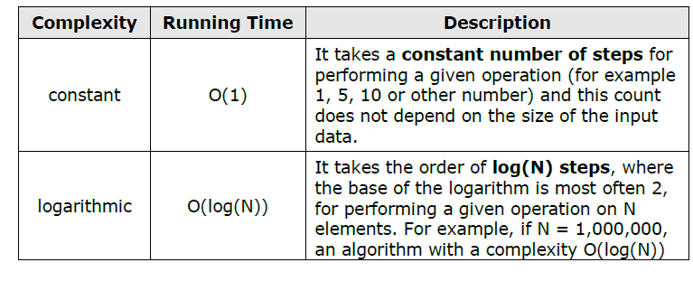
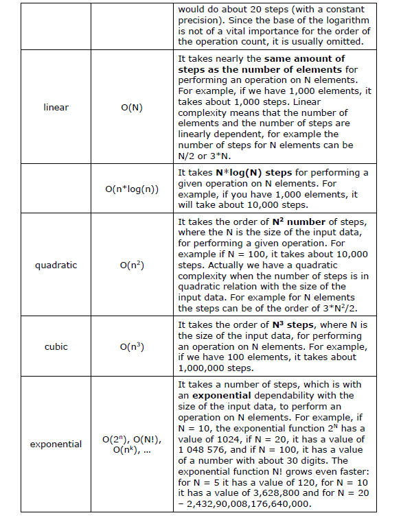

# Data Structures and Algorithm Complexity

Data structures and algorithms are the fundamentals of programming. To become a good developer, it is essential to master the basic data structures and algorithms and learn to apply them in the right way.

## Algorithm Complexity

Algorithm complexity is a measure which evaluates the order of the count of operations, performed by a given algorithm as a function of the size of the input data. Complexity is a rough approximation of the number of steps necessary to execute an algorithm.

Algorithm complexity is commonly represented with the O(f) notation, also known as asymptotic notation or “Big O notation”, where f is the function of the size of the input data. The asymptotic computational complexity O(f) measures the order of the consumed resources (CPU time, memory, etc.) by certain algorithm expressed as function of the input data size.

Complexity can be constant, logarithmic, linear, n\*log(n), quadratic, cubic, exponential, etc. This is respectively the order of constant, logarithmic, linear and so on, number of steps, are executed to solve a given problem. For simplicity, sometime instead of “algorithms complexity” or just “complexity” we use the term “running time”.

### Typical Algorithm Complexities

When evaluating complexity, constants are not taken into account because they do no significantly affect the count of operations.

## Complexity and Execution Time
