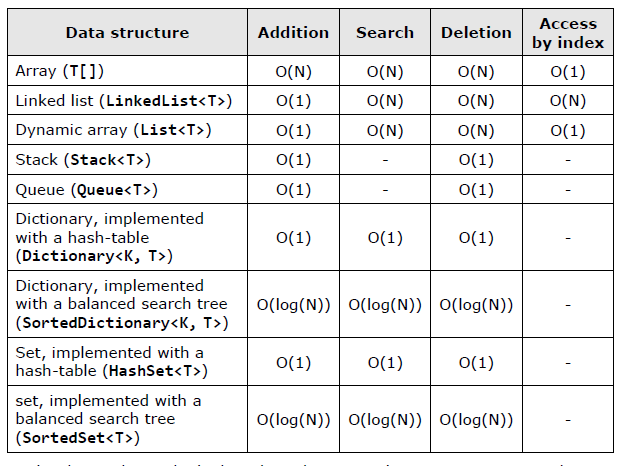

# Data Structures and Algorithm Complexity

Data structures and algorithms are the fundamentals of programming. To become a good developer, it is essential to master the basic data structures and algorithms and learn to apply them in the right way.

## Algorithm Complexity

Algorithm complexity is a measure which evaluates the order of the count of operations, performed by a given algorithm as a function of the size of the input data. Complexity is a rough approximation of the number of steps necessary to execute an algorithm.

Algorithm complexity is commonly represented with the O(f) notation, also known as asymptotic notation or “Big O notation”, where f is the function of the size of the input data. The asymptotic computational complexity O(f) measures the order of the consumed resources (CPU time, memory, etc.) by certain algorithm expressed as function of the input data size.

Complexity can be constant, logarithmic, linear, n\*log(n), quadratic, cubic, exponential, etc. This is respectively the order of constant, logarithmic, linear and so on, number of steps, are executed to solve a given problem. For simplicity, sometime instead of “algorithms complexity” or just “complexity” we use the term “running time”.

### Typical Algorithm Complexities

When evaluating complexity, constants are not taken into account because they do no significantly affect the count of operations.

## Complexity and Execution Time

The execution speed of a program depends on the complexity of the algorithm, which is executed. If this complexity is low, the program will execute fast even for a big number of elements. If the complexity is high, the program will execute slowly or will not even work (it will hang) for a big number of elements.

- Algorithms with a constant, logarithmic or linear complexity are so fast that we cannot feel any delay, even with a relatively big size of the input data.
- Complexity O(n\*log(n)) is similar to the linear and works nearly as fast as linear
- Quadratic algorithms work very well up to several thousand elements
- Cubic algorithms work well if the elements are not more than 1000
- Generally these so called polynomial algorithms (any, which are not exponential) are considered to be fast and working well for thousands of elements
- Generally the exponential algorithms do not work well and we should avoid them when possible.

### Complexity by Several Variables

Complexity can depend on several input variables at once. For example, if we look for an element in a rectangular matrix with sizes M and N, the searching speed depends on M and N. Since in the worst case, we have to traverse the entire matrix, we will do M*N number of steps at most. Therefore the complexity is \*\*O(M*N)\*\*

### Best, Worst and Average Case

Complexity of algorithms is usually evaluated in the worst case (most unfavorable scenario). This means in the average case, they can work faster but in the worst case, they work with the evaluated complexity and not slower.

### Roughly Estimated Complexity

Sometimes it is hard to evaluate the exact complexity of a given algorithm, because it performs operations and is not known exactly how much time they will take and how many operations will be done internally.

### Complexity by Memory

Besides the number of steps using a function of the input data, one can measure other resources, which as algorithm uses, for example memory, count of disk operations.

## Comparison between Basic Data Structures

### When to Use a Particular Data Structure

#### Array(T[])

The arrays are collections of fixed number of elements from a given type (for example numbers) where the elements preserved their order. Each element can be accessed through its index. The arrays are memory areas, which have a predefined size.

- Adding a new element is an array is a slow operation. To do this, we have to allocate a memory with the same size plus one and copy all the data from the original array to the new one.
- Searching in an array takes time because we have to compare every element to the searched value.
- Removing an element from an array is a slow operation. We have to allocate a memory with the same size minus one and copy all the old elements except the removed one.
- Accessing by index is direct, and thus, a fast operation.

The arrays should be used only when we have to process a fixed number of elements to which we need a quick access by index.For example, if we have to sort some numbers, we can keep them in an array and then apply some of the well-known sorting algorithms. If we have to change the elements' count, the array is not the correct data structure we should use.

#### Singly/Doubly Linked List (LinkedList<T>)

Singly and doubly linked lists hold collection of elements, which preserve their order. Their representation in the memory id dynamic, pointer-based. They are linked sequences of elements.

- Adding is a fast operation but it is slower than adding to a `List<T>` because every time when we add an element to a linked list we allocate a new memory area. The memory allocation works at speed which cannot be easily predicted.
- Searching in a linked list is a slow operation because we have to traverse through all of its elements.
- Accessing an an element by index is a slow operation because there is no indexing in single and doubly linked list. You have to go through all the elements from the start one by one instead.
- Removing an element at a specified index is slow operation because reaching the element through its index is a slow operation.Removing an element with a specified value is a slow operation too, because it involves searching.
- Linked list can quickly add and remove elements (with a constant complexity) at its two ends (head and tail). Hence, it is very handy for an implementation of stacks, queues and similar data structures.

Linked lists are rarely used in practice because the dynamic arrays (`List<T>`) can do almost exact same operations LinkedList does, plus for the most of them it works faster and more comfortable.

When you need a linked list, use `List<T>` instead of `LinkedList<T>`, because it doesn’t work slower and it gives you better speed and flexibility. Use LinkedList when you have to add and remove elements at both ends of the data structure.

#### Dynamic Array (List<T>)

Dynamic array (`List<T>`) is one of the most popular data structures used in programming. It does not have fixed size like arrays and allows direct access through index, unlike linked lists.The dynamic array is also known as "array list", "resizable array" and "dynamic array".

`List<T>` holds its elements in an array, which has a bigger size than the count of the stored elements. Usually when we add an element, there is an empty cell in the list’s inner array. Therefore this operation takes a constant time. Occasionally the array has been filled and it has to expand. This takes linear time, but it rarely happens. If we have a large amount of additions, the average-case complexity of adding an element to `List<T>` will a constant – O(1). If we sum the steps needed for adding 100,000 elements (for both cases – "fast add" and "add with expand") and divide by 100,000, we will obtain a constant which will be nearly the same like for adding 1,000,000 elements.

This statistically-averaged complexity calculated for large enough amount of operations is called amortized complexity. Amortized linear complexity means that if we add 10,000 elements consecutively, the overall count of steps will be of the order of 10,000. In most cases add it will execute in a constant time, while very rarely adding will execute in linear time.

- Searching in `List<T>` is a slow operation because you have to traverse through all the elements.
- Removing by index or value executes in a linear time. It is a slow operation because we have to move all the elements after the deleted one with one position to the left.
- The indexed access in **`List<T>`** is instant, in a constant time, since the elements are internally stored in an array

The dynamic array (`List<T>`) is appropriate, when we have to add elements frequently as well as keeping their order of addition and access them through index.If we often have to search or delete elements, `List<T>` is not the right data structure.

#### Stack

Stack is a linear data structure in which there are 3 operations defined: adding an element at the top of the stack (push), removing an element from the top of the stack (pop) and insect the element from the top without removing it (peek). All these operations are very fast - it takes a constant time to execute them. The stack does not support the operations search and access through index.

The stack is a data structure, which has a LIFO behavior (last in, first out). It is used when we have to model such a behavior - for example, if we have to keep the path to the current position in a recursive search.

#### Queue

Queue is a linear data structure in which there are two operations defined: adding an element to the tail (enqueue) and extract the front-positioned element from the head (dequeue). These two operations take a constant time to execute, because the queue is usually implemented with a linked list. The linked list can quickly add and remove elements from its both ends.

The queue's behavior is FIFO (first in, first out). The operations searching and accessing through index are not supported. Queue can naturally model a list of waiting people, tasks or other objects, which have to be processed in the same order as they were added (enqueued).

As an example of using a queue we can point out the implementation of the BFS (breadth-first search) algorithm, in which we start from an initial element and all its neighbors are added to a queue. After that they are processed in the order they were added and their neighbors are added to the queue too. This operation is repeated until we reach the element we are looking for or we process all elements.
