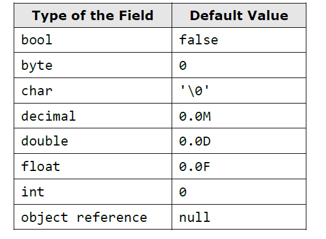

# Defining Classes

The aim of every program written by the programmer is to solve a given problem based on the implementation of a certain idea. In order to create a solution,first, we sketch a simplified actual model, which does not represent everything, but focuses on these facts, which are significant for the end result. Afterwards based on the sketched model, we are looking for an answer(i.e to create an algorithm) for our problem and the solution we describe via given programming language

Nowadays, the most used programming languages are the object-oriented. And because the object-oriented programming(OOP) is close to the way humans think, using one easily allows us to describe models of the surrounding life.Certain reason for this behavior is, because OOP offers tools to draw the set of concepts, which outline classes of objects in every model. The term – class and the definition of custom classes, different from the .NET system framework’s, is built-in feature of the C# programming language.

## Classes and Objects

**Class** in the OOP paradigm is called a definition(specification) of a given type of objects from the real-world. The class represents a pattern, which describes the different states and behavior of the certain objects(the copies), which are created from this class(pattern)
**Object** is a copy created from the definition(specification) of a given class also called an instance. When one object is created by the description of one class, we say the object is from type "name of the class"

## What does a Class Contain

Every class contains a definition of what kind of data types and objects has in order to be described. The object holds the actual data. The data defines the object's state.

In addition to the stae, in the class is described the behavior of the objects. The behavior is represented by actions, which can be performed by the objects themselves.The resource in OOP, through which we can describe this behavior of the objects from a given class, is the declaration of methods in the class body.

## Elements of the Class

The main elements of a C# class are the following:

- **Class declaration** - this is the line where we declare the name of the class

```C#
public class Dog
```

- **Class body** - similar to the method idioms in the language, the classes also have single class body. It is defined right after the class declaration, enclosed in curly brackets "{" and "}". The content inside the brackets is known as body of the class. The elements of the class, which are numbered below, are part of the body.

```C#
public class Dog
{

}
```

- **Constructor** - it is used for creating new objects. Here is a typical constructor

```C#
public Dog()
{
    // ..Some code ..
}
```

- **Fields** - they are variables, declared inside the class(somewhere in the literature are known as member-variables). The data of the object, which these variables represent, and are retained into them is the specific state of an object, and one is required for the proper work of object’s methods. The values, which are in the fields, reflect the specific state of the given object, but despite of this there are other types of fields, called static, which are shared among all the objects.

```C#
//Field definition
private string name;
```

-**properties** - this is the way to describe the characterisics of a given class.Usually, the value of the characteristics is kept in the fields of the object. Similar to the fields, the properties may be held by certain object or to be shared among the rest of the objects.

```C#
//Property definition
private string Name{get;set}
```

- **Methods** - We know that methods are names blocks of programming code. They perform particular actions and through them the objects achieve their behavior based on the class type. Methods execute the implemented programming logic(algorithms) and handling of data.

## Nature of Objects

When we create an object in .NET, one consists from two parts - the significant part(data), which contains its data and it is located in the memory of the operating system called dynamic memory(heap) and a reference part to this object, which resides in the other part of the operating system's memory, where the local variables an parameters of the methods are stored(the program execution stack).

For example, let's have a class called `Dog`, which has the properties for name,kind,and age. Lets create a variable from this class. This variable is a reference to the object and is in the dynamic memory(heap).

The `reference` is a variable which can access objects. When we declare one variable from type a particular class, and we do not want the variable to be associated with a specific object, then we assign to it the value null. The reserved word `null` in the C# language means that the variable does not point to any object(there is a missing value)

## Organizing Classes in Files and Namespaces

The namespaces in C# are named group of classes, which are logically connected, without a requirement of how they are stored in the file system. If we want to include in our code namespaces for the operation in our classes, declared in some file or set of files, this should be done by the so named **using directives**. They are not required, but if they exist, they are on the first lines in the class file, before the declaration of the classes or other types.

After the insertion of the used namespaces, the next is the declaration of the namespace of the classes in the file. As we know, there is no requirement to declare classes in a namespace, but it is a good programming technique if we do it, because the class distribution in the namespace is used for better organization of the code and determination of the classes with equal names.

The namespaces contain classes, structure, interfaces and other types of data, and as well other namespaces. An example of nested namespace is System, which contains the namespace Data. The full name of the second namespace is System.Data and one is nested in the namespace System.

The full name of a class in .NET Framework is the class name, preceded by the namespace in which the class is declared, e.g.: <namespace_name>. <class_name>. By the using reserved word we can use types from certain namespace, without writing the full name, e.g.:

```C#
using System;

...
DateTime date;
```

## Modifiers and Access Levels (Visibility)

A modifier is a reserved word which gives additional information for the compiler.
In C#, there are 4 access modifiers: **public, private, protected and internal**. The access modifiers can be used only in front of the following elements of a class: class declaration, fields, properties and methods

### Access Level 'public'

When we use the modifier **public** in front of some element, we are telling the compiler, that this element can be accessed from every class, regardless of the current project(assembly), from the current namespace. The access level public defines the absence of restirctions regarding the visibility.

### Access Level 'private'

This access level defines the most restrictive level of visibility of the class and its elelments. The modifier _private_ is used to indicate, that the element, to which is issued, cannot be accessed from any other class (except the class in which it is defined), even if this class exists in the same namespace.This is the default access level, i.e. it is used when there is no access level modifier in front of the respective element of a class (this is true only for elements inside a class).

### Access Level 'internal'

The modifier 'internal' is used to limit the access to the elements of the class only to files from the same assembly i.e the same project in Visual Studio.When we create several projects in Visual Studio, the classes from will be compiled in different assemblies.

## Assemblies

An assembly is a file that is automatically generated by the compiler upon successful compilation of every .NET application.It can be either a Dynamic Link Library or an executable file. It is generated only once for an application and upon each subsequent compilation, the assembly gets updated.

An assembly is the compiled output of your code, typically a DLL, but your EXE is also an assembly. It's the smallest unit of deployment for any .NET project.

The assembly typically contains .NET code in MSIL (Microsoft Intermediate language) that will be compiled to native code ("JITted" - compiled by the Just-In-Time compiler) the first time it is executed on a given machine. That compiled code will also be stored in the assembly and reused on subsequent calls.

The assembly can also contain resources like icons, bitmaps, string tables and so on. Furthermore, the assembly also contains metadata in the assembly manifest - information like version number, strong name, culture, referenced assemblies and so forth.

In 99% of your cases, one assembly equals a physical file on disk - the case of a multi-file assembly (one assembly, distributed across more than a single file) appears to be a rather odd-ball edge case which I've never encountered so far in my 5+ years of .NET development.

In a multifile assembly there would still be only one assembly manifest in a DLL or EXE and the MSIL code in multiple netmodule files.

## Declaring Classes

        [<access_modifier>] class <class_name>

Besides the reserved word **class** and the name of the class, in the declaration of the class we can use several modifiers.

## Class Visibility

Let's consider two classes - A and B. We say that, class A accesses the elements of class B, if the first class can do one of the following

- Creates an object(instance) from class type B
- Can access distinct methods and fields in the class B, based on the access level assigned to the particular methods and fields

### Access Level 'public'

If we declare a class access modifier as public, we can reach it from every class and from every namespace, regardless of where it exists. It means that every other class can create objects from this type and has access to the methods and the fields of the public class.
Just to know, if we want to use a class with access level public from other namespace, different from the current, we should use the reserved word for including different namespaces using or every time we should write the full name of the class.

### Access Level 'internal'

If we declare one class with access modifier internal, one will be accessible only from the same namespace. It means that only the classes from the same assembly can create objects from this type class and to have access to the methods and fields (with related access level) of the class. This access level is the default, where it is not used access modifier by the declaration of the class.
If we have two projects in common solution in Visual Studio and we want to use a class from one project into the other one then the referenced class should be declared as public.

### Access Level 'private'

Private classes like other private members are accessible only inside the class which defined them

### Class Naming Convention

- The names of the classes begin with capital letter, and the rest of the letters are lower case. If the name of the class consists of several words, every word begins with capital letter, without separator to be used. This is the well-known PascalCase convention.
- For name of the classes nouns are usually used.

## The Reserved Word 'this'

The reserved word **this** in C# is used to reference the current object, when one is used from a method in the same class. this is the object, with which the method or constructor is called. The reserved word can be deemed as an address(reference),

### Fields

Objects describe things from the real world. In order to describe an object, we focus on its characteristics, which are related to the problems solved in our program. These characteristics of the real-world object we will hold in the declaration of the class in special types of variables. These variables, called fields (or member-variables), are holding the state of the object. When we create an object based on certain class definition, the values of the fields are containing the characteristics of the created object (its state). These characteristics have different values different for the different objects.

#### Declaring Fields in a Class

Until now we have discussed only two types of variables (see "Methods") depending on where they are declared:

1. Local variables – these are the variables declared in the body of some method (or block).
2. Parameters – these are the variables in the list of parameters, which one method can have.

In C# a third type of variable exists, called field or instance variable.
Fields are declared in the body of the class, outside the body of a single method or constructor. Fields are declared in the body of the class but not in the bodies of the methods or the constructors.

e.g

```C#
class SampleClass
{
    int age;
    long distance;
    string[] names;
    Dog myDog;
}

```

More formal, the declaration of a field is done in the following way:

        [<modifiers>] <field_type> <field_name>;

The <field_type> part determinates the type of a given field. This type can be primitive (byte, short, char and so on), an array, or also some class type (e.g. Dog or string).The <field_type> part determinates the type of a given field. This type can be primitive (byte, short, char and so on), an array, or also some class type (e.g. Dog or string).

The <modifiers> part is a definition, which describes the access modifiers and as well other modifiers. The last ones are not a mandatory part of the field declaration.

#### Field Scope

The scope of a class field starts from the line where is declared and ends at the closing bracket of the body of the class.

#### Initialization during Declaration

When we declare one field it is possible to assign to it an initial value. We do this similarly to an assignment of normal local variable:

        [<modifiers>] <field_type> <field_name> = <initial_value>;

Of course, the <initial_value> has to be a type compatible with the field’s type, e.g.:

```C#
class SampleClass
{
int age = 5;
long distance = 234; // The literal 234 is of integer type
string[] names = new string[] { "Peter", "Martin" };
Dog myDog = new Dog();
//other code
}

```

#### Default Values of the Fields

Every time we cretae a new object of a given class, it is allocated memory in the heap for every field from the class. In order for this to be done, the memory is initialized automatically with the default values for the certain field. The fields, which do not have explicitly a default value in the code, use the default value specified for the .NET type, to which they belong.

This is different for the local variables defined in methods. If a local variable in a method does not have a value assigned, the code will not compile. If a member variable (field) in a class does not have a value assigned, it will be automatically zeroed by the compiler.

When an object is created all of the fields are initialized with their respective default values in .NET, except if they are not explicitly initialized with some other value.

The value of all types is 0 or something similar. For the most used types these values are as the follows:



Unlike fields, local variables are not initialized with default values when they are declared.If we define a local variable in one method, without initializing it, and afterward we try to use it (e.g. printing its value), this will trigger a compilation error, because the local variables are not initialized with default values when they are declared.

#### Custom Default Values

A good programming practice is, when we declare fields in the class, to explicitly initialize them with some default value, even if the default value is zero. This will make our code clearer and easy to read.
e.g

```C#
class SampleClass
{
int age = 0;
long distance = 0;
string[] names = null;
Dog myDog = null;
// … Other code …
}
```

#### Modifiers 'const' and 'readonly'

In the declaration of one field is allowed to use the modifications **const** and **readonly**. The fields, declared as **const** or **readonly** are called constants. They are used when a certain value is used several times. These values are declared only once without repetitions

##### Constants Based on "const"

The fields, declared with **const** have to be initialized during the de facto declaration and afterwards their value cannot be changed. They can be accessed without creating an instance(object) of te class and they are commong for all created objects in our program.

##### Constants Based on "readonly"

The modifier **readonly** creates fields, which values cannot be changed once they are assigned. Fields, declared as **readonly** allow one-time initialization either in the moment of the declaration or in the class constructor

### Methods

Declaring of Class Method

```C#
// Method definition
[<modifiers>] [<return_type>] <method_name>([<parameters_list>])
{
// … Method's body …
[<return_statement>];
}
```

#### Accessing Non-Static Fields from Non-Static Method

We know that the word **this** is a reference to the current object, in which the method resides. Formally, the declaration of access to a field in the boundaries of a class is the following

        this.<field_name>

This access option is possible only from non-static code i.e method or block, which is without **static** modifier. Apart from retrieving of the value of one field, we can use the reserved word **this** for modification of the field.

#### Calling Non-Static Methods

Like the fields, which do have **static** modifier in their declarations, the methods, which are also non-static, can be called in the body of a class via the reserved word **this**.

        this.<"method_name">(..)

#### Skip _this_ Keyword When Accessing Non-Static Data

When we access the fields of a class or we call its non-static methods, it is possible to omit the reserved word this. the reserved word _this_ is used to indicate explicitly that we want to have access to a non-static field of a class or to call some of its non-static methods.

#### Hiding Fields with Local Variables

As mentioned, the scope of one field starts from the line where the declaration is made to the closing curly bracket of the class. On the other hand, when we implement the body of one method, we have to declare local variables which we will use for the work of the method. The scope of a local variable begins from the line where it is declared to the closing bracket of the body of the method.

Sometimes the name of the local variable can overlap with the name of some field. In this case there is a collision. C# allows defining local variables, which names match with fields of the class. If this happens, we say that the scope of the local variable overlays the field variable (scope overlapping).

Despite this, sometimes it is required use the field instead the local variable with the same name. In this case, to retrieve the value of the field, we use the reserved word this. For this purpose we access the field by using the "dot" operator, applied to the reserved word this. In this way, we say deliberately that we want to use the field of the class, and not the local variable with the same name.

### Visibility of Fields and Methods

Separate from the declaration of a class, when we declare fields and methods in the class we can use four access levels - **public**, **protected**,**internal**, and **private**.

#### Access Level 'public'

When a method or a value of a class is declared with access level **public**, it can be used from any other class, regardless of whether the calling class is declared in the same namespace, assembly or outside it.

#### Access Level 'internal'

When a memeber of some class is declared with access level **internal**, then this element from the class can be accessed from every class in the same assembly(i.e in the same project in Visual Studio), but not from classes outside it (i.e from other projects in Visual Studio- from the same solution or from a different solution)
Not that if we have a Visual Studio project, all classes in it are from the same assembly and classes defined in different Visual Studio projects (in the same or in a different solution) are from different assemblies

#### Access Level 'private'

The access level, which is the most restrictive, is private. The elements of the class, wich are declared with access modifier private(or without any because private is the default one), cannot be accessed outside of the class in which they are declared.

When assigning access modifiers to a field, one or more of these have to be **private** because this ensures that the highest level of security is applied to the field. The access and the modification of the values from other classes(if it is required) will be done only via properties or methods.

## Constructors

In object-oriented programming, when creating an object from a given class, it is necessary to call a special method of the class known as a constructor. The constructor is a pseudo-method, which does not have a return type, has the name of the class and is called using the keyword new. The task of the constructor is to initialize the memory, allocated for the object where its fields will be stored(those which are not static ones)

The only way to call a constructor in C# is through the keyword new. It allocates memory for the new object(in the stack or in the heap, depending on whther the object is a value type or a reference type), resets its fields to zero, calls their constructors(or chain of constructors, formed in succession), and at the end returns a reference to the newly created object

### Process of Creating a new Object by the Constructor

- First, **memory is allocated** for the object
- Next, its fields (if any) are initialized with the default values for their respective types
- If the creation of the new object is successfully completed, the **constructor** returns a reference to it, which is assigned to a variable from the object's Class type.

### Declaring a Constructor

        [<modifiers>] <class_name>([<parameters_list>])

Constructors are similar to methods, but they do not have a return type.

In C#, it is mandatory that the name of every constructor matches the name of the class in which it resides - <"class_name">. It is not possible to declare a method whose name matches the name of the class.

### Parameter List

Similar to the methods, if we need extra data to create an object, the constructor gets it through a parameter list - <"parameters_list">
Of course, after the declaration of the constructor its body is following, which is like every method body in C#, but generally contains mostly initialization logic, i.e. setting the initial values of the fields of the class.

### Visibility of the Constructors

Similar to the methods and the fields, the constructors can be declared with levels of visiblity: public, protected, internal, protected and private.

### Order of Initialization of the Fields

- First memory is allocated for the respective field in the heap and this memory is initialized with the default value of the field type.
- After the initialization of the fields with the default value for the respective type, the second step in CLR (Common Language Runtime) is to assign a value to the field if such has been set when declaring the field.

Only after these two steps of initializing the fields of the class (default value initialization and possibly the value set by the programmer during the declaration of the field) the constructor of the class is called. At this time, the fields get the values, which are set in the body of the constructor.

### Declaring a Constructor with Parameters

Very often, during the declaration of the constructor, we don't know what values the various fields will take. To tackle this problem, the required information, similar to the methods with paramteres, the fields are assigned the values, given to them in the body of the constructor e.g

```C#
public Dog(string dogName,int dogAge,double dogLength)
{
        name = dogName;
        age = dogAge;
        length = dogLength;
        collar = new Collar();
}
```

Similarly, the call of a constructor with parameters is done in the same way as the call of method with parameters - the required values are supplied as a list, the elements are separated with commas.

```C#
static void Main()
{
Dog myDog = new Dog("Moby", 2, 0.4); // Passing parameters
Console.WriteLine("My dog " + myDog.name +
" is " + myDog.age + " year(s) old. " +
" and it has length: " + myDog.length + " m.");
}

```

There is no limitation for the number of constructors of a class in C#. The only requirement is that they differ in their signature
