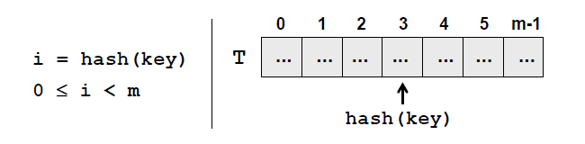

## Dictionary Data Structure

Dictionaries are also known as associative arrays or maps. Every element in the dictionary has a key and an associated value for this key. Both the key and the value represent a pair.
When using dictionaries, the set of keys usually is a randomnly chosen set of values like real numbers or strings. The only restriction is that we distringuish one key from the other.
For every key in the dictionary, there is a corresponding value. One key can hold only one value. The aggregation of all the pairs (key,value) represents the dictionary

### The Abstract Data Structure "Dictionary" (Associative Array, Map)

In programming, the abstract data structure "dictionary" is represented by many aggregated pairs (key, value) along with predefined methods for accessing the values by a given key. Alternativelt, this data strucure can also be called a "map" or "associative array"

Described below are the required operations, defined by this data structure:

- **void Add(K key, V value)** - adds given key-value pair in the dictionary. With most implementations of this class in .NET, when adding a key that already exists, an exception is thrown.
- **V Get(K key)** - returns the value by the specified key. If there is no pair with this key, the method returns null or throws an excpetion depending on the specific dictionary implentation
- **bool Remove(key)** - removes the value, associated with the specified key and returns a Boolean value indication if the operation was successful.

Here are some additional methods, which are supported by the ADT.

- **bool Contains(key)** - returns true if the dictionary has a pair with the selected key
- **int Count** - returns the number of elements (key value pairs) in the dictionary

Other operations that are usually supported are: extracting all of the keys, values or key value pairs and importing them into another structure (array, list)

### The Interface IDictionary<K,V>

In .NET, there is a standard interface **`IDictionary<K,V>`**, where K defines the type of the key, and V th type of the value. If defines all of the basic operations that the dictionaries should implement. `IDictionary<K,V>` corresponds to the abstract data structure "dictionary" and defines the operations, mentioned above, but without supplying an actual implementation of them. Interfaces define which methods and fields should be implmented in the classes that inherit the interface.

In .NET Framework there are two major implementations of the interface `IDictionary<K, V>` – `Dictionary<K, V>` and `SortedDictionary<K, V>`. `SortedDictionary` is an implementation by a balanced (red-black) tree, and `Dictionary` – by a hash-table.

#### Implementation of Dictionary with Red-Black Tree

A red-black tree is an ordered binary balanced search tree, that's used for searching. This is why one of the important requirements for the set of keys used by `SortedDictionary<K,V>` is comparability. This means that, if we have two keys, either one of them should be bigger, or they should be equal. The keys used in `SortedDictionary<K,V>` should implement `IComporable<K>`

The usage of the binary search tree gives us a great advantage: the keys in the dictionary are stored ordered. Thanks to this feature, if we need the data ordered by keys, we don't need to perform any additional sorting. Actually, this is the only advantage this dictionary implementation compared to the hash-table

A things that should be mentioned is that keeping the keys ordered comes with its price. Searching for the elements using an ordered balanced tree is slower (typically takes log(n) steps) than using a hash-table (O(1)). Because of this, if there is no requirement for the keys to be ordered, its better to use **`Dictionary<K,V>`**

##### IComparable<K> Interface

When using `SortedDictionary<K,V>` the keys are required to be **comparable**. In our example we use objects of type **string**.
The class **string** implements the interface **IComparable** and the comparison between the elements is done lexicographically. By default, the strings in .NET are case sensitive. This means that words that start with a lowercase letter will be before the ones with an uppercase letter. This definition comes from the implementation of the method **CompareTo(object)**, through which the **string** class implements the interface **IComparable**.

##### IComparer<T> Interface

What should we do when we are not happy with the default implementation of comparison? For example, what should we so when we want uppercase and lowercase chracters to be treated as equal ?

For the comparison of objects with an exclusively defined order in `SortedDictionary<K,V>` in .NET, we will use the interface `IComparable<T>`. It defines a comparison function **int Compare(T x, T y)** that is an alternative to the already defined order.

When we create an object of type `SortedDictionary<K,V>`, we can pass to its constructor a reference to `IComparable<K>` so that it can use it for the key comparison (key elements should be objects of type K).

After using `IComparerer<E>`, we changed the definition for ordering keys in our dictionary. If, for a key, we used a class, defined by us, for example - **Student**, that implements `IComparable<E>`, we would get the same result if we were to alter the method `CompareTo(Student)`. There is also one additional requirement, when implementin `IComparable<K>`:
When two objects are equal (Equals(object) returns true), CompareTo(E) should return 0.

Meeting this requirement would allow us to use the objects of a custom class as keys, just as in the implementation of a balanced tree.

#### Dictionary Implmentation with Hash-Table

With a hash-table implementation, the time for accessing the elements in the dictionary is theoretically independent from their count. This is a very important advantage. With hash-tables, if we have a key, the number of comparisons that we would need to do to find out if there is a key with this calue, is constant and it does not depend on the number of elements.

##### What is a Hash Table?

The data structure hash-table is usually implemented internally with an array. It consists of numerated elements (cells), each either holding a key-value pair or is empty (null).

In computing, a **hash table (hash map)** is a data structure that implements an associative array abstract data type, a structure that can map keys to values. An associative array (map/symbol table/dictionary) is an abstract data type composed of a collection of key,value pairs, such that each possible key appears at most once in the collection.

Operations associated with associative arrays are:

- the addition of a pair to the collection
- the removal of a pair from the collection
- the modification of an existing pair
- the lookup of a value associated with a particular key

A hash table uses a hash function to complete an index, also called a hash code, into an array of buckets or slots, from which the desired value can be found. Ideally , the hash function will assign each key to a unique bucket, but most hash table designs employ an imperfect hash function, which might cause hash collisions where the hash function generates the same index for more than one key. Such collisions must be accomodated in some way.

In a well-dimensioned hash table, the average cost (number of instructions) for each lookup is independent of the number of elements stored in the table. Many hash table designs also allow arbitrary insertions and deletions of key-value pairs, at (amortized) constant average cost per operation.

The size of the internal storage array of the hash-table is called capacity. The load factor is a real number between 0 and 1, which stands for the ratio between the occupied elements and the current capacity. For example, if we have a hash-table with 3 eolements and capacity m, the load factor for this hash-table would be 3/m.

When adding or searching for elements, a method for hashing the key(hash function) is executed, this returns a number we call a hash-code. When we take the division remainder of this hash-code and the capacity m, we get a number between 0 and m-1

        index = hash(key) % m

The figure below shows a hash-table T with capacity m and hash-function hash(key)

This value hash(k) gives us the position in the array at which we search or add a certain key-value pair having this k.If the hash function distributes the keys uniformly, in most cases every key will have a different hash value assigned. In this way, every cell of the array will have at most one key. Ultimately, we get an extremely fast search and insertion of the elements: just calculate the hash function and obtain the cell assigned for the key. Of course, it may occur that different keys would have the same hash code.

The internal table's capacity is increased when the number of elements in the hash-table becomes greater or equal to a certain constant called fill factor (load factor, the maximal degree of filling). When increasing the capacity (usually doubling it), all of the elements are reordered by the hash code of their keys and their assigned cell is calculated according to the new capacity. The load factor is significantly decreased after the reordering. This operation is time-consuming, but it is executed relatively rare, so it will ot impact the overall performance of the add operation.

Hash tables (unlike balanced trees), the elements are not kept sorted.

#### Class Dictionary<K,V>

The class `Dictionary<K,V>` is a standard implementation of dictionary based on hash-table in .NET Framework.

#### Hashing and Hash-Fucntions

The hash-code is a number returned by the hash-function, used for the hashing of the key. This number should be different for every key, or atleast there should be a high chance for that.

##### Hash-Functions

There is the concept of the perfect hash-function. One hash-function is perfect, if for example you have N keys, and for each of them the function would add a different number in a reasonable interval. Finding such a function in the common case is a very hard, almost impossible task. It's worth to use such functions when using sets of keys with predefined elements or when the set of keys is rearely changed.

In practice, there are also other, not so 'perfect' hash-functions.
