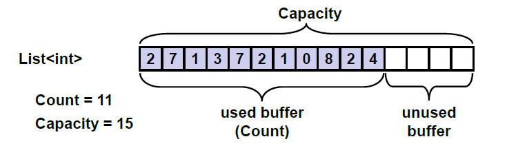

# Linear Data Structures

Very often, in order to solve a given problem, we need to work with a sequence of elements. Depending on the task, we have to apply different operations on this set of data.

- Abstract data types(ADT)
- Linked list
- Doubly-linked list
- array-list
- stacks
- queue

## Abstract Data Structures

Very often, when we write programs, we have to work with many objects(data). Sometimes we add and remove elements, other times we would like to order them to process the data in another specific way. For this reason, different ways of storing data are developed, depending on the task. Most frequently, these elements are ordered in some way. At this point, we come to the need of data structures -a set od data organized on the basis of logical and mathematical laws. Very often, the right data structure makes the program much more efficient - we could save memory and execution time.

In general, abstract data types(ADT) gives us a definition(abstraction) of the specific structure i.e. defines the allowed operations and properties without being interested in the specific implementation. This allows an abstract data type to have several different implementations and repectively different efficiency.

The definition of ADT only mentions what operations are to be performed but not how these operations will be implemented. It does not specify how data will be organized in memory and what algorithms will be used for implementing the operations. It is called "abstract" because it gives an implementation-independedn view. The process of providing only the essentials and hiding the details is known as abstraction.

### Basic Data Structures in Programming

We can differentiate several groups of data structures:

- **Linear** - these include lists, stacks and queues
- **Tree-like** - different types of tress like binary trees, B-trees and balanced trees
- **Dictionaries** - key-value pairs organized in hash tables
- **Sets** - unordered bunches of unique elements
- **Others** - multi-sets, bags, multi-bags, priority queues, graphs

Mastering basic data atsructures in programming is essential,as without them we could not program efficiently.

## List

We could imagine the list as an ordered sequence (line) of elements. List is a linear data atsructure, which contains a sequence of elements. The list has the property length(count of elements) and its elements are arranged consecutively.

The list allows adding elements on different positions, removing them and incremental crawling.

An Interface in C# is a type definition similar to a class, except that it purely represents a contract between an object and its user. It can neither be directly instantiated as an object, nor can data members be defined. So and interface is nothing but a collection of method and property declarations.

Each ADT defines some interface. Let's consider the interface System.Collections.IList. The basic methods, which it defines are:

- int Add(object) - adds element in the end of the list
- void Insert(int,object) - adds elements on a preliminary chosen position in the list
- void Clear() - removes all elements in thenlist
- bool Contains(object) - checks whether the list contains the element
- void Remove(object) - removes the element from the list
- void RemoveAt(int) - removes the element on a given position
- int IndexOf(object) - returns the position of the element
- this[int] - indexes, allows access to the elements on a set position

Let’s see several from the basic implementations of the ADT list and explain in which situations they should be used.

### Static List(Array-Based Implemkentation)

Arrays perform many of the features of the ADT list, but there is a significant difference - the lists allow adding new elements, while arrays have fixed size.

Despite of that, an implementation of list is possible with an array, which automatically increments its size.

### Linked List (Dynamic Implementation)

The static list has a serious disadvantage - the operations for inserting and removing items from the inside of the array requires rearrangement of the elements. When frequenctly inserting and removing items(especially a large number of items), this can lead to low performance. In such cases, it is advisable to use the so called linked lists. The difference in them is the structure of elements - while in the static list the element contains only the specific object, with the dynamix list, the elements keep information about their next element.

For the dynamic implementation of the linked list, we will need two classes: the class ListNode, which will hold a single element of the list along with its next element, and the main list class `DynamicList<T>` which will hold a sequence of elements as well as the **head** and the **tail** of the list.

```C#
using System;
namespace linked_list_implementation
{
    public class DynamicList<T>
    {
        private class ListNode
        {
            public T Element { get; set; }
            public ListNode NextNode { get; set; }

            public ListNode(T element)
            {
                this.Element = element;
                NextNode = null;
            }
            public ListNode(T element, ListNode prevNode)
            {
                this.Element = element;
                prevNode.NextNode = this;
            }
        }
        private ListNode head;
        private ListNode tail;
        private int count;
       public DynamicList()
{
this.head = null;
this.tail = null;
this.count = 0;
}
    }

}
```

First, let's consider the recursive class `ListNode`. It holds a single element and a reference(pointer) to the next element which is of the same class **ListNode**. So **ListNode** is an example of recursive data structure that is defeined by referincing itself. It is an inner class to the **`DynamicList<T>`** - it is declared as a private member and is therefore accessible only to it. For our **`DynamicList<T>`** , we create 3 fields: **head** - pointer to the first element, **tail** - pointer to the last element and count - counter of the elements.

Upon the initial construction, the list is empty and for this reason, we assign **head=tail=null** and **count=0**.

We are going to implement all basic operations: adding and removing items, as well as searching for an element and accessing the elements by index.

### Comparing the Static and the Dynamic Lists

We implemented the abstract type(ADT) list in two ways: static(array list) and dynamic (linked list). Once written, these two implementations can be used in almost excatly the same way. Thus, certain ADT could be implemented in several conceptually different ways and the users may not notice the difference betwwen them. Still, different implementations could have different performance and could take different amount of memory.

### Doubly-Linked List

In the so called doubly-linked lists, each element contains its value and two pointers - to the previous and to the next element (or null if there is no such element). This allows us to traverse the list forward and backward and some operations to be implemented more efficiently.


## The ArrayList Class

Various classes in C# deliver list data structures "without lifting a finger". The first one is the class **ArrayList** which gives the opportunity to add, delete and search for elements in it. The **ArrayList** is an untyped dynamically-extendable array.

In case we would like to make an array of numbers and then process them, for example to find their sum, we have to convert the **object** type to a number. This is because **ArrayList** is actually a list of elements of type object and not from some specifi type(like int or string)

In C#, **dynamic** is a universal data type intended to hold any value (numbers, objects, strings, even functions and methods). Operations over **dynamic** variables (like the `+` operator) are resolved at runtime and their action depends on the actual values of their arguments. At compile time almost every operation with dynamic variables successfully compiles. At runtime, if the operation can be performed, it is performed, otherwise and exception is thrown.

## Generic Collections

When we use the **ArrayList** class and all classes, which implement the interface **System.IList**, we face the problem of when we add a new element from a class, we pass it as a value of type object. Later , when we search for a certain element, we get it as **object** and we have to cast it to the expected type (or use dynamic). It is not guaranteed, however that all elements in the list will be of one and the same type. Besides this, the conversion from one type to another takes time, and this drastically slows down the program execution.

To solve the problem we use the generic (template / parameterized) classes. They are created to work with one or several types, as when we create them, we indicate what type of objects we are going to keep in them.

### The List<T> Class

**`List<T>`** is the generic variant of **ArrayList**. When we create an object of type `**List<T>**`, we indicate the type of the elements , which will be held in the list.

It keeps its elements in the memory as an array, which is partially in use and partially free for new elements (blank). Thanks to the reserved blank elements in the array, the operation append almost always manages to add the new element without the need to resize the array. Sometimes, of course, the array has to be resized, but as each resize would double the size of the array, resizing happens so seldom that it can be ignored in comparison to the count of append operations. We could imagine a List<T> like an array, which has some capacity and is filled to a certain level:



Thanks to the preliminarily allocated capacity of the array, containing the elements of the class `List<T>`, it can be extremely efficient data structure when it is necessary to add elements fast, extract elements and access the elements by index. Still, it is pretty slow in inserting and removing elements unless these elements are at the last position.

We could say that List<T> combines the good sides of lists and arrays – fast adding, changeable size and direct access by index.

#### When to Use List<T>

The `List<T>` class uses a inner array for keeping the elements and the array doubles its size when it gets overfilled. Such implementation causes the following good and bad effects:

- The search by index is very fast – we can access with equal speed each of the elements, regardless of the count of elements.
- The search for an element by value works with as many comparisons as the count of elements (in the worst case), i.e. it is slow.
- Inserting and removing elements is a slow operation – when we add or remove elements, especially if they are not in the end of the array, we have to shift the rest of the elements and this is a slow operation.
- When adding a new element, sometimes we have to increase the capacity of the array, which is a slow operation, but it happens seldom and the average speed of insertion to List does not depend on the count of elements, i.e. it works very fast.

        Use List<T> when you don't expect frequent insertion and deletion of elements but you expect to add new elements at the end of the list or to access elements by index.

##### Union and Intersection of Lists

Let's consider a more interesting example - let's write a program, which can find the union and the intersection of two sets of numbers.

#### Converting a List to Array and Vice Versa

In C#, the conversion of a list to an array is easy by using the given method **ToArray()**. For the opposite operation, we could use the contructor of **`List<T>(Sytem.Array)`**

```C#
static void Main()
{
int[] arr = new int[] { 1, 2, 3 };
List<int> list = new List<int>(arr);
int[] convertedArray = list.ToArray();
}
```

#### The LinkedList<T> Class

The class is a dynamic implementation of a doubly linked list built in .NET Framework. Its elements contain a certain value and a pointer to the previous and the next element.

With a view to the structure of the linked list, we have to have the following in mind

- The append operation is very fast, because the list always knows its last element(tail)
- Inserting a new element at a random position in the list is very fast(unlike List<T>) if we have a pointer to this position e.g if we insert at the list start or at the list end
- Searching for elements by index or by value in LinkedList is a slow operation as we have to scan all elements consecutively beginning from the start of the list.
- Removing elements is a slow operation, because it includes searching

##### When Should We Use LinkedList<T>?

Using LinkedList<T> is prefereble when we have to add/remove elements at both ends of the list and when the access to the elements is consequential.

However, when we have to access the elements by index, then List<T> is a more appropriate choice.

Considering memory, LinkedList<T> generally takes more space because it holds the value and several additional pointers for each element. List<T> also takes additional space because it allocates memory for more elements than it actually uses (it keeps bigger capacity than the number of its elements).

#### Stack

The stack is a data structure which implements the behaviour "last in - first out"(LIFO). The Stack ADT provides 3 major operations: push(add an element at the top of the stack), pop(take the last added element from the top of the stack) and peek(get the element from the top of the stack without removing it)

The data structure stack can also have different implementations, such as dynamic and static implementation.

Like with the static list we can use an array to keep the elements of the stack. We can keep an index or a pointer to the element, which is at the top.

For the dynamic implementation of stack we use elements, which keep a value and a pointer to the next element. This linked-list based implementation does not require an internal buffer, does not need to grow when the buffer is
full and has virtually the same performance for the major operations like the static implementation

##### The Stack<T> Class

In C#, we could use the standard implementation of the class in .NET Framework System.Collections.Generics.Stack<T>.It is implemented statically with an array, as the array is resized when needed.

All basic operations for working with a stack are implemented:

- Push(T) – adds a new element on the top of the stack
- Pop() – returns the highest element and removes it from the stack
- Peek() – returns the highest element without removing it
- Count – returns the count of elements in the stack
- Clear() – retrieves all elements from the stack
- Contains(T) – check whether the stack contains the element
- ToArray() – returns an array, containing all elements of the stack
