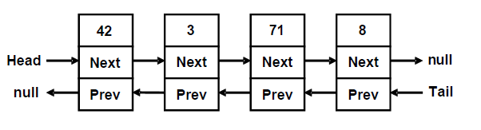

# Linear Data Structures

Very often, in order to solve a given problem, we need to work with a sequence of elements. Depending on the task, we have to apply different operations on this set of data.
- Abstract data types(ADT)
- Linked list
- Doubly-linked list
- array-list
- stacks
- queue

## Abstract Data Structures

Very often, when we write programs, we have to work with many objects(data). Sometimes we add and remove elements, other times we would like to order them to process the data in another specific way. For this reason, different ways of storing data are developed, depending on the task. Most frequently, these elements are ordered in some way. At this point, we come to the need of data structures -a set od data organized on the basis of logical and mathematical laws. Very often, the right data structure makes the program much more efficient - we could save memory and execution time.

In general, abstract data types(ADT) gives us a definition(abstraction) of the specific structure i.e. defines the allowed operations and properties without being interested in the specific implementation. This allows an abstract data type to have several different implementations and repectively different efficiency.

The definition of ADT only mentions what operations are to be performed but not how these operations will be implemented. It does not  specify how data will be organized in memory and what algorithms will be used for implementing the operations. It is called "abstract" because it gives an implementation-independedn view. The process of providing only the essentials and hiding the details is known as abstraction.


### Basic Data Structures in Programming

We can differentiate several groups of data structures:

- **Linear** - these include lists, stacks and queues
- **Tree-like** - different types of tress like binary trees, B-trees and balanced trees
- **Dictionaries** - key-value pairs organized in hash tables
- **Sets** - unordered bunches of unique elements
- **Others** - multi-sets, bags, multi-bags, priority queues, graphs

Mastering basic data atsructures in programming is essential,as without them we could not program efficiently.

## List

We could imagine the list as an ordered sequence (line) of elements. List is a linear data atsructure, which contains a sequence of elements. The list has the property length(count of elements) and its elements are arranged consecutively.

The list allows adding elements on different positions, removing them and incremental crawling.

An Interface in C# is a type definition similar to a class, except that it purely represents a contract between an object and its user. It can neither be directly instantiated as an object, nor can data members be defined. So and interface is nothing but a collection of method and property declarations.

Each ADT defines some interface. Let's consider the interface System.Collections.IList. The basic methods, which it defines are:
- int Add(object) - adds element in the end of the list
- void Insert(int,object) - adds elements on a preliminary chosen position in the list
- void Clear() - removes all elements in thenlist
- bool Contains(object) - checks whether the list contains the element
- void Remove(object) - removes the element from the list
- void RemoveAt(int) - removes the element on a given position
- int IndexOf(object) - returns the position of the element
- this[int] - indexes, allows access to the elements on a set position

Let’s see several from the basic implementations of the ADT list and explain in which situations they should be used.

### Static List(Array-Based Implemkentation)

Arrays perform many of the features of the ADT list, but there is a significant difference - the lists allow adding new elements, while arrays have fixed size.

Despite of that, an implementation of list is possible with an array, which automatically increments its size.

### Linked List (Dynamic Implementation)

The static list has a serious disadvantage - the operations for inserting and removing items from the inside of the array requires rearrangement of the elements. When frequenctly inserting and removing items(especially a large number of items), this can lead to low performance. In such cases, it is advisable to use the so called linked lists. The difference in them is the structure of elements - while in the static list the element contains only the specific object, with the dynamix list, the elements keep information about their next element.

For the dynamic implementation of the linked list, we will need two classes: the class ListNode, which will hold a single element of the list along with its next element, and the main list class `DynamicList<T>` which will hold a sequence of elements as well as the **head** and the **tail** of the list.

```C#
using System;
namespace linked_list_implementation
{
    public class DynamicList<T>
    {
        private class ListNode
        {
            public T Element { get; set; }
            public ListNode NextNode { get; set; }

            public ListNode(T element)
            {
                this.Element = element;
                NextNode = null;
            }
            public ListNode(T element, ListNode prevNode)
            {
                this.Element = element;
                prevNode.NextNode = this;
            }
        }
        private ListNode head;
        private ListNode tail;
        private int count;
       public DynamicList()
{
this.head = null;
this.tail = null;
this.count = 0;
} 
    }
  
}
```

First, let's consider the recursive class `ListNode`. It holds a single element and a reference(pointer) to the next element which is of the same class **ListNode**. So **ListNode** is an example of recursive data structure that is defeined by referincing itself. It is an inner class to the **`DynamicList<T>`** - it is declared as a private member and is therefore accessible only to it. For our **`DynamicList<T>`** , we create 3 fields: **head** - pointer to the first element, **tail** - pointer to the last element and count - counter of the elements.

Upon the initial construction, the list is empty and for this reason, we assign **head=tail=null** and **count=0**.

We are going to implement all basic operations: adding and removing items, as well as searching for an element and accessing the elements by index.

### Comparing the Static and the Dynamic Lists

We implemented the abstract type(ADT) list in two ways: static(array list) and dynamic (linked list). Once written, these two implementations can be used in almost excatly the same way. Thus, certain ADT could be implemented in several conceptually different ways and the users may not notice the difference betwwen them. Still, different implementations could have different performance and could take different amount of memory.

### Doubly-Linked List

In the so called doubly-linked lists, each element contains its value and two pointers - to the previous and to the next element (or null if there is no such element). This allows us to traverse the list forward and backward and some operations to be implemented more efficiently.

