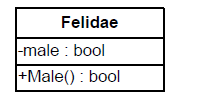

# Object-Oriented Programming Principles

**Classes** are a description (model) of real objects and events referred to as entities. Classes posses characteristics referred to as properties.

Classes also expose behavior known as methods. Methods and properties can be visible only within the scope of the class, which declared them and their descendants (private/protected) or visible to other classes (public)
Objects are instances of classes.

Object-oriented programming is the successor of procedural (structural) programming. Procedural programming describes programs as groups of reusable code units (procedures) which define input and output parameters.Procedural programs consist of procedures, which invoke each other.

The problem with procedural programming is that code reusability is hard and limited - Only procedures and it is hard to make them generic flexible. There is no easy way to work with abstract data structures with different implementations.

The object-oriented approach relies on the paradigm that each and every program works with data that describes entities (objects or events) from real life.

This is how objects came to be. They describe characteristics (properties) and behavior(methods) of such real life entities.
The main advantages and goals of OOP are to make complex software faster to develop and easier to maintain. OOP enables the easy reuse of code by applying simple and widely accepted rules.

## Fundamental Principles of OOP

In order for a programming language to be object-oriented, it has to enable working with classes and objects as well as the implementation and use of the fundamental object-oriented principles and concepts: inheritance,abstraction, encapsulation and polymorphism.

### Encapsulation

Encapsulation refers to the bundling of data with the methods that operate on that data, or the restricting of direct access to some of an object's components. Encapsulation is used to hide the values or state if structured data object inside a class, preventing unauthorized parties direct access to them. Publicly accessible methods are generally provided in the class to access the values, and other client classes call these methods to retrieve and modify the values within the object.

### Inheritance

Inheritance is the mechanism of basing an object or class upon another object(prototype-bases inheritance) or class (class-based inheritance), retaining similar implementation.

### Abstraction

The process of hiding unnecessary details from the user that enables the user to implement more complex logic on top of the provided abstraction without understanding or even thinking about all the hidden complexity.

### Polymorphism

Polymorphism is the ability of an object to take on many forms.

### Inheritance

Inheritance is a fundamental principle of object-oriented programming. It allows a class to 'inherit' (behavior or characteristics) of another, more general class.

The class from which we inherit is referred to as parent class or base class/super class.

```C#

public class Lion : Felidae
{
private int weight;
// Keyword "base" will be explained in the next paragraph
public Lion(bool male, int weight) : base(male)
{
this.weight = weight;
}
public int Weight
{
get { return weight; }
set { this.weight = value; }
}

```

#### The "base" Keyword

In the above example, we used the keyword **base** in the constructor of the class **Lion**. The keyword indicates that the base class must be used and allows access to its methods, constructors and member variables. Using **base()**, we can all the constructor of the base class. Using **base.Method(...)**, we can invoke a method of the base class, pass parameters to it and use its results. Using base.field, we can get the value of a member variable from the base class or assign a different one to it.

In .NET, methods inherited from the base class and declared as virtual can be overridden. This means changing their implementation; the original source code from the base class is ignored and new code takes its place. We can invoke non-overridden methods from the base class without using the keyword **base**. Using the keyword is required only if we have an overridden method or variable with the same name in the inheriting class.

The keyword base can be used explicitly for clarity. **base.Method(...)** calls a method, which is necessarily from the base class. Such source code is easier to read, because we know where to look for the method in question.

#### Constructors with Inheritance

When inheriting a class, our constructors must call the base class constructor, so that it can initialize its member variables. If we do not do this explicitly, the compiler will place a call to the parameter less base class constructor "**:base()**"

If the base class has no default constructor (one without parameters) or that constructor is hidden, our constructors need to explicitly call one of the other base class constructors. The omission of such a call will result in a compile error.

If a class has private constructors only, then it cannot be inherited. If a class has private constructors only, then this could indicate many other things. For example, no-one (other than that class itself) can create instances of such a class. Actually, that's how one of the most popular design patterns (Singleton) is implemented.

Calling the constructor of a base class happens outside the body of the constructors. The idea is that the fields of the base class should be initialized before we start initializing fields of the inheriting class, because they might depend on a base class field.

### Access Modifiers of Class Members and Inheritance

There is public, private and internal. Additional, protected and protected internal

- **protected** - defines class members which are not visible to users of the class (those who initialize and use it), but are visible to all inheriting classes (descendants)
- **protected internal** - defines class members which are both internal i.e. visible within the entire assembly, and protected i.e. not visible outside the assembly, but visible to classes who inherit it (even outside the assembly)

When a base class is inherited:

- All of its **public**,**protected** and **protected internal** members (methods, properties) as visible to the inheriting class.
- All of its private methods, properties and member-variables are not visible to the inheriting class
- All of its internal members are visible to the inheriting class, only if the base class and the inheriting class are in the same assembly

### The System.Object Class

In .NET, every class, which does not inherit a class explicitly, inherits the system class System.Object by default. The compiler takes care of that. All objects can be perceived as instances of this class. It is convenient that this class contains important methods and their default implementation.

Every class, which inherits from another class indirectly, inherits **Object** from it. This way every class inherits explicitly or implicitly from Object and contains all of its fields and methods.

Because of this property, every class instance can be cast to Object.

The generic types (generics) have been provided specifically for working with collections and objects of different types. They allow creating typified classes.

### .NET Standard Libraries and Object

In .NET, there are a lot of predefined classes. These classes are part of the .NET framework; they are available wherever .NET is supported. These classes are refereed to as Common Type System (CTS).

.NET also provides a lot of libraries, which can be referenced additionally, and it stands to reason that they are called class libraries or external libraries.

### The Base Type Object Upcasting and Downcasting

```C#
public class ObjectExample
{
    static void Main()
    {
        AfricanLion africanLion = new AfricanLion(true,80);
        //Impilicit casting
        object obj = africanLion;
    }
}

```

In this example, we cast an **AfricanLion** to **Object**. This operation is called upcasting and is permitted because **AfricanLion** is an indirect child of **Object** class.

```C#

AfricanLion africanLion = new AfricanLion(true,80);
//Implicit casting
object obj = africanLion;

try{
    //Explicit casting
    AfricanLion castedLion = (AfricanLion)obj;
}
catch(InvalidCastException ice)
{
    Console.WriteLine("obj cannot be downcasted to AfricanLion");
}

```

In this example, we cast an Object to AfricanLion. This operation is called downcasting and is permitted only if we indicate the type we want to cast to, because Object is a parent class of AfricanLion and it is not clear if the variable obj is of type AfricanLion. If it is nor, an InvalidCastException will be thrown.

##### The Object.ToString() method

One of the most commonly used methods, originating from the class **Object** is **ToString()**. It returns a textual representation of an object.

Notice that ToString() is invoked implicitly. When we pass an object to the WriteLine() method, that object provides its string representation using ToString() and only then it is printed to the output stream. That way, there’s no need to explicitly get string representations of objects when printing them.

#### Virtual Methods: the "override" and "new" Keywords

We need to explicitly instruct the compiler that we want our method to **override** another. In order to do this, we use the **override keyword**.

When we use the keyword **new**, we create a new method, which hides the old one. The old method can then only be called with an upcast.

It turns out that when we override a method, we cannot access the old implementation even if we use upcasting. This is becasue there are no longer two **ToString()** methods, but rather only the one we overrode.

A method, which can be overridden is called **virtual**. In .NET, methods are not virtual by default. If we want a method to be overridable, we can do so by including the keyword **virtual** in the declaration of the method.

The explicit instructions to the compiler that we want to override a method (by using override) is a protection against ,mistakes. If there's a typo in the method's name or the types of its parameters, the compiler will inform us immediately of this mistake. It will know something is not right when it cannot find a method with the same signature in any of the base classes.

#### Transitive Properties of Inheritance

In mathematics, transitivity indicates transferability of relationships. Let's take the indicator "larger than" (>) as an example. If A>B and B>C, we can conclude that A > C. This means that the relation "larger than" (>) is transitive, because we can unequivocally determine whether A is larger or smaller than C and vice versa.

If the class **Lion** inherits the class **Felidae** and the class **AfricanLion** inherits **Lion**, then this implies that **AfricanLion** inherits **Felidae**. Therefore **AfricanLion** has the property **Male** which is defined in **Felidae**. This useful property allows a particular functionality to be defined in the most appropriate class.

It is because of the transitive property of inheritance that we can be sure that all classes include the method **ToString()** and all other methods of **Object** regardless of which class they inherit.

#### Inheritance Hierarchy

If we try to describe all big cats, then, sooner or later, we will end up with a relatively large group of classes which inherit one another. All these classes, combined with the base classes, form a hierarchy of big cat classes. The easiest wat to describe such hierarchies is by using class diagrams.

#### Class Diagrams

A class Diagram is one of several types of diagrams defined in UML. UML (Unified Modeling Language) is a notation for visualizing different processes and objects to software development.

It is commonly accepted to draw class diagrams as rectangles with name attributes (member variables) and operations (methods). The connections between them are denoted with various types of arrows.
Pieces of terminology

- Generalization - is a term signifying the inheritance of a class or the implementation of an interface
- The other term is association. An association, would be, e.g "The Lion has paws", where Paw is another class. Association is has-a relationship.

This is what a sample class diagram looks like:


The class is represented as a **rectangle**, divided in 3 boxes one under another. The name of the class is at the top. Next, there are the attributes (UML term) of the class (in .NET they are called member variables and properties). At the very bottom are the operations (UML term) or methods (in .NET jargon). The plus/minus signs indicate whether an attribute /operation is visible  (+ means public) or not visible (-  means private). Protected members are marked with #.

Associations denote connections between classes. They model mutual relations. They define multiplicity.

#### Aggregation

Aggregation is a special type of association. It models the relationship of kind "whole/part". We refer to the parent class as an aggregate. The aggregated classes are called components.

Composition is an aggregation where the components cannot exist without the aggregate.


### Abstraction

Abstraction means working with something we know how to use without knowing how it works internally. Abstraction is an important concept in OOP. It allows us to write code, which works with abstract data structures (like dictionaries, lists, arrays and others). We can work with an abstract data type by using its interface without concerning ourselves with its implementation.

Abstraction allows us to do something very important - define an interface for our applications i.e. to define all tasks the program is capable of executing and their respective input and output data. That way, we can make a couple of small programs, each handling a smaller task. When we combine this with the ability to work with abstract data, we achieve great flexibility in integrating these small programs and much more opportunities for code reuse.

#### Interfaces
In the C# languages, the interface is a definition of a role (a group of abstract actions). It defines what sort of behavior a certain object must exhibit without specifying how this behavior should be implemented. Interfaces are also know as contract or specifications.

An object can have multiple roles (or implement multiple interfaces/contracts) and its users can utilize it from different points of view.

An interface can only declare methods and constants. A method signature is the combination of a method's name and a description of its parameters(type and order). A declaration is the combination of a method's return type and its signature. The return type only specifies what the method returns.

A class / method implementation is the source code of a class/method.

In an interface, methods are only declared; the implementation is coded in the class implementing the interface. The class that implements a certain interface must implement all methods in it. The only exception is when the class is abstract. Then it can implement none, some or all of the methods. All remaining methods have to be implemented in some of the inheriting classes.

#### Abstraction and Interfaces

The best way to achieve abstraction is by working through interfaces. A component works with interfaces which another implements. That way, a change in the second component will not affect the first one as long as the new component implements the old interface. The interface is also called a contract. Every component upholds a certain contract (the signature of certain methods). That way, two components upholding a contract can communicate with each other without knowing how their counterpart works.

Some important interfaces from the Common Type System (CTS) are the list and collection interfaces: `System.Collections.Generic.IList<T>` and `System.Collections.Generic.ICollection<T>`. All of the standard .NET collection classes implement these interfaces and the various components pass different implementations (arrays, linked lists, hash tables, etc.) to one another using a common interface.
Collections are an excellent example of an object-oriented library with classes and interfaces that actively use all core principles of OOP: abstraction, inheritance, encapsulation and polymorphism.

##### When Should We Use Abstraction and Interfaces
 
The answer to this question is: always when we want to achieve abstraction of data or actions, whose implementation can change later on. Code, which communicates with a other piece of code through interfaces is much more resilient to changes than code written using specific classes. Working through interfaces is common and a highly recommended practice.

It is always a good idea to use interfaces when functionality is exposed to another component. In the interface, we include only the functionality (in the form of a declaration) that others need to see.

Internally, a program/ component can use interfaces for defining roles. That way, an object can be used by different classes through different roles.

### Encapsulation

Encapsulation is one of the main concepts in OOP. It is also called "information hiding". An object has to provide its users only with the essential information for manipulation, without the internal details.

The person writing the class has to decide what should be hidden and what not. When we program, we must define as **private** every method or field which other classes should not be able to access.

