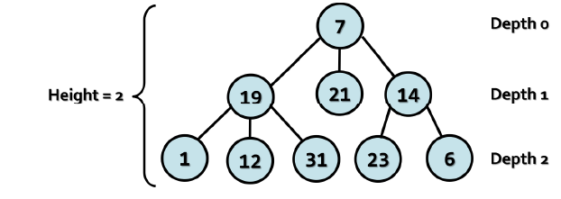
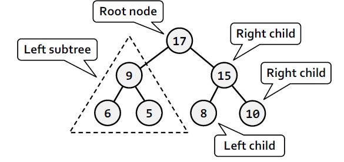
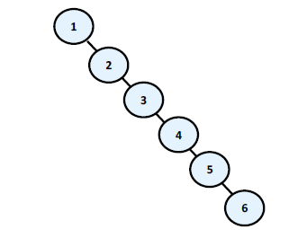
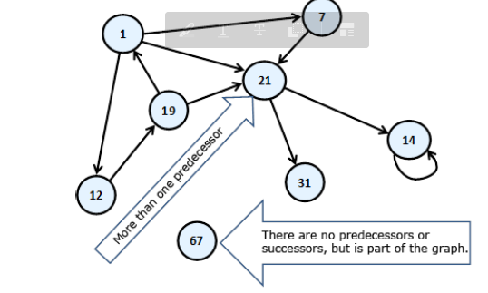

# Trees and Graphs

- binary trees, binary search trees and self balanacing binary search tree
- graph, types of graphs and how to represent a graph in the memory

# Tree Data Structures

Very often we have to describe a group of real life objects, which have such relation to one another that we cannot use linear data structures for their description. A tree-like data structure or branched data structure consists of a set of elements(nodes) which could be linked to other elements, sometimes hierarchially, sometimes not. Trees represent hierarchies, while graphs represent more general relationsh such as the map of a city

## Trees

Trees are very often used in programming, because they naturally represent all kinds of object hierarchies from our surroundings.

### Trees Terminology

We will simplify the figure describing our hierarchy. We assume it consists of circles and lines connecting them. For convenience, we name the circles with unique numbers, so that we can easily specify about which one we are talking about.

We will call every circle a node and each line an edge.direct descendants (child nodes) of node "7", and node "7" their parent. The same way "1", "12" and "31" are children of "19" and "19" is their parent. Intuitively we can say that "21" is sibling of "19", because they are both children of "7" (the reverse is also true – "19" is sibling of "21").For "1", "12", "31", "23" and "6" node "7" precedes them in the hierarchy, so he is their indirect parent – ancestor, ant they are called his descendants.

The **Root** is the node without a parent. In our example this is node 7.

**Leaf** is a node without child nodes. In our example - "1","12","31","21","23" and "6"

**Internal nodes** are the nodes , which are not leaf or root ( all nodes, which have parent and at least one child.) Such nodes are "19" and "14"

A **Path** is called a sequence of nodes connected with edges in which there is no repetion of nodes. Example of path is the sequence "1", "19", "7" and "21". The sequence "1", "19" and "23" is not a path, because "19" and "23" are not connected.

**Path lenght** is the number of edges, connecting the sequence of nodes in the path. It is equal to the number of nodes in the path minus 1. The length of our example for path ("1", "19", "7" and "21") is three.

**Depth** of a node we will call the length of the path from the root to a certain node. In our example "7" as root depth zero, "19" has depth one and "23" has depth two.

Tree is a recursive data structure, which consists of nodes, connected with edges. The following statements are true for trees

- Each node can have 0 or more direct descendats(children)
- Each node has at most one parent. There is only one special node without a parent - the root (if the tree is not empty)
- All nodes are reachable from the root - there is a path from the root top each node in the tree.

**The Height of a tree** - is the maximu depth of all its nodes. In our example the tree height is 2.
**The Degree** of the node is the _number of direct children_ of the given node. The degree of "19" and "7" is three, but the degree of "14" is two. The leaves have degree zero.

**Branching factor** is the maximu of the degrees of all nodes in the tree. In our example, the maximu degree of the nodes is 3, so the branching factor is 3.

### Tree Implementation - Example

Our tree will contain numbers inside its nodes, and each node will have a list of zero or more children, which are trees too (following our recursive definition)

Each node is recursively defined using itself. Each node of the tree (**`TreeNode<T>`**) contains a list of children, which are nodes. The tree itself is another class **`Tree<T>`** which can be empty or can have a root node.

#### How Does the Implementation Work

The function associated with a node, like creating a node, adding a child node to this node, and getting the number of children are implemented at the level of **`TreeNode<T>`**.

The rest of the functionality (traversing the tree fo rexample) is implemented at the level of **`Tree<T>`**. Logically dividing the fucntionality between the two classes makes our implementation more flexible.

The reason we divide the implementation in two classes is that some operations are typical for each separate node(adding a child for example), while others are about the whole tree (searching a node by its number). In this variant of the implementation, the tree is a class that knows its root and each node knows its children. In this implementation we can have an empty tree (when root =null).

#### Depth-First-Search (DFS) Traversal

The Depth-First-Search algorithm aims to visit each of the tree nodes exactly once. Such a visit of all nodes is called tree traversal.

The DFS algorithm starts from a given node and goes as deep in the tree hierarchy as it can. Whenit reaches a node, which has no children to visit or all have been visited, it returns to the previous node. We can describe the depth-first search algorithm by the following simple steps:

- Traverse the current node - e.g print it on the console or process it in some way
- Sequentially traverse recursively each of the current nodes' child nodes (traverse the sub-trees of the current node).This can be done by a recursive call to the same method for each child node.

The DFS algorithm is a recursive algorithm that uses the idea of backtracking. It involves exhaustive searches of all the nodes by going ahead if possible, else by backtracking.

Here, the word backtrack means that when you are moving forward and there are no more nodes along the current path, you move backwards on the same path to dind nodes to traverse. All the nodes will be visited on the current path till all the unvisited nodes have been traversed after which the next path will be selected.

We make creating a tree easier by defining a special constructor, which takes for input parameters a node value and a list of its sub-trees. That allows us to give any number of type **`Tree<T>`** (sub-trees)

#### Traverse the Hard Drive Directories

### Bread-Frist Search (BFS)

**Breadth-First Search(BFS)** is an algorithm for traversing branched data structures (like trees and graphs). The BFS algorithm first traverses the start node, then all its direct children, then their direct children and so on. This approach is also known as the wavefront traversal, because it looks like the waves caused by a stone thrown into a lake.

The **Breadth-Frist Search (BFS) algorithm** consists of the following steps:

1. Enqueue the start node in queue Q
2. While Q is not empty, repeat the following steps
   - Dequeue the next node v from Q and print it
   - Add all children of v in the queue

The BFS algorithm is very simple and always traverses first the nodes that are closest to the start node, and then the more distant and so on until it reaches the furthest. The BFS algorithm is very widely used in problem solving e.g for finding the shortest path in labyrinth.

### Binary Trees

This type of tree turns out to be very useful in programming. The terminology for trees is also valid about binary trees
Binary Tree is a tree which nodes have a degree equal or less than 2. Because every node's children are at most 2, we call them left child and right child. They are the roots of the left sub-tree and the right sub-tree of their parent node. Some nodes may have only left or only right child, not both. Some nodes may have no children and are called leaves.

Binary tree can be recursively defined as follows: a single node is a binary tree and can have left and right children which are also binary trees.

We have to note that there is one very big difference in the definition of binary tree from the definition od the classical tree - the order of the children of each node. Although we take binary trees as a special case of a tree structure, we have to notice that the condition for particular order of children nodes makes them a completely different structure.

The traversal of binary tree is a classic problem which has classical solutions. Generally, there are few ways to traverse a binary tree recursively:

- In-order (Left-Root-Right) - the traversal algorithm first traverses the left sub-tree, then the root and last the right sub-tree.
- Pre-order (Root-Left-Right) - in this case the algorithm first traveses the root, then the left sub-tree and last the right sub-tree.
- Post-order(Left-Right-Root) - here we first traverse the left subtree, then the right one last the root.

### Ordered Binary Search Trees

We have seen how to build traditional and binary trees. These structures are very summarized in themselves and it will be difficult for us to use them for a bigger project. Practically, in computer science, special and programming variants of binary and ordinary trees are used that have certain special characteristics, like order, minimal depth and others.

As examples for a useful properties we can give the ability to quickly search for an element by given value (Red-Black tree); order of elements in the tree (ordered search trees); balanced depth(balanced trees);possiblity to store an ordered tree in persistent storage so that searching an element to be fast with as little as possible read operations(B-tree)

They use one often met property of the nodes in the binary trees - unique identification key in every node. Important property of these keys is that they are comparable.

#### Comparability between Objects

Comparability - we call two objects A and B comparable, if exactly one of the following 3 dependencies exists:

- A is less than B
- A is bigger than B
- A is equal to B

The nodes of a tree can contain different fields but we think about only thier unique keys , which we want to be comparable.

And we arrive to the definition of the ordered binary seach tree:

- **Ordered Binary Tree(binary search tree)** is a binary tree, in which every node has a unique key, every two of the keys are comparbale and the tree is organized in a way that for every node the following is satisfied

- All keys in the left sub-tree are smaller than its key
- All keys in the right sub-tree are bigger than its key

#### Properties of the Ordered Binary Search Trees

By definition, we know that the left sub-tree of every node consts of elements which are smaller than itself. While the right sub-tree, there are only bigger elements. This means that if we want to find a given element, starting from the root, either we have found it or should search it respectively in its left or right sub-tree, which will save unneccessary comparisons.

From the elements' order follwos that the smallest element in the tree is the leftmost successor of the root, if there is such or the root itself, if it does not have a left successor. Next useful property from this is, that every single element from the left sub-tree of the given node is smaller than every single element from the right sub-tree of the same node.

#### Comparability betwwen Objects in C

What does "comparability between objects" mean for us as developers? It means that we must somehow oblige everyone who uses our data structure, to create it passing it a type, which is comparable.

        T : IComparable<T>

The interface `IComparable<T>`, located in the namespace `System`, specifies the method `CompareTo(T obj)`, which returns a negative integer number, zero or a pasitive intgeger number respectively if the current object is less, equal or bigger than the one which is given to the method for comparing.

On one hand, the implementation of this interface by given class ensures that its instances are comparable. On the other hand, we need those nodes, described by `BinaryTreeNode<T>` class to be comparable between each other. That is why it implements `IComparable<T>` too. The implementation of `IComparable<T>` to the `BinaryTreeNode<T>` class calls the type T's implemntation internally.

Now, we go to the implementation of the class, describing an ordered binary tree - `BinarySearchTree<T>`. The tree by itself as a structure cconsists of a root node of type `BinaryTreeNode<T>`, which contains internally its successors - left and right. Internally, they also contain their successors, thus recursively down unitl it reaches the leaves.

An important thing is the definition `BinarySearchTree<T>` where T : `IComparable<T>`. This constraint of the type T is necessary because of the requirement of our internal class, which works only with types, implementing `IComparable<T>`. Due to this restriction we can use `BinarySearchTree<int>` and `BinarySearchTree<string>`, but cannot use `BinarySearchTree<int[]>` and `BinarySearchTree<StreamReader>`, because int[] and StreamReader are not comparable, while int and string are.

We are to implement the following operations on the orderd binary tree - insert,searching,remobing

- **insert** - Inserting(or adding) an element in a binary search tree means to put a new element somewhere in the tree so that the tree must stay orded.
  If the tree is empty, we add the new element as a root:
- If the element is smaller than the root, we call recurssively the same method to add the element in the left sub-tree
- If the element is bigger than the root, we call recursivley to the same method to add the element in the right sub-tree
- If the element is equal to the root, we don't do anything and exit from the recursion.

We can clearly see how the algorithm for inserting a node conforms to the rule "elemnts in the left sub-tree are less than the root and the elements in the right sub-tree are bigger than the root".

#### Searching for an Element

Searching in a binary search tree is an operation which is more intuitive. The algorithm starts with element node, pointing to the root. After that, we do the following:

- If the element is equal to the node, we have found the searched element and return it.
- If the element is smaller than the node, we assigne to node its left successor i.e we continue the searching in the left sub-tree.
- If the element is bigger than the node, we assign to node its right successor i.e we continue the searching in the right sub-tree

At the end, the algorithm returns the found node or null if there is no such node in the tree. Additionally, we define a Boolean method that checks if certain value belongs to the tree

#### Removing an Element

Removing an element is the most complicated operation from the basic binary search tree operations. After it the tree must keep its order.

The first step before we remove an element from the tree is to find it. We already know how it happens:

- If the node is a leaf - we point its parent's reference to null. If the element has no parent, it means that it is a root and we just removed it.
- If the node has only one sub-tree - left or right, it is replacing with the root of this sub-tree
- If the node has two sub-trees. Then we have to find the smallest node in the right sub-tree and swap with it. After this exchange, the node will have one sub-tree at most and then we remove it grounded on some of the above two rules

### Balanced Trees

As we have seen, the ordered binary trees are a very comfortable structure to search within. Defined in this way, the operations for creating and deleting the tree have a hidden flaw: they don't balance the tree and its depth could become very big

Think about it, what will happen if we sequentially include the elements: 1,2,3,4,5,6? The ordered binary tree will look like this:

In this case, the binary tree degenrates into a linked list. Because of this the searching in this tree is going to be much slower (with N steps not with log(N), as to check whether an item is inside, in the worst case we will have to go through all elements)

There exists data structures which save the logarithmic behavious of the operations adding , searching and removing an element in the common case

- **Balanced binary tree** - a binary tree in which no leaf is at 'much greater' depth than any other leaf. The definition 'much greater' is roughh and depends on the specific balancing scheme.
- **Perfectly balanced binary tree** - binary tree in which the difference in then left and right tree nodes' count of any node is at most one.

Without going in details, we will mention that when given binary search tree is balanced, even when not perfectly balanced, then the operations of adding, searching and removing an element in it will run in approximtely a logarithmic number of steps even in the worst case. To avoid imbalance in the tree to search, apply operations that rearrange some elements of the tree when adding or removing an item from it. These operations are called rotations in most of the cases. The type of rotation should be further specified and depends on the implementation of the specific data structure. As examples for structures like these, we can give Red-Black tree, AVL-tree, AA-tree, Splay-ree and others.

Balanced search trees allow quickly(in general case for approximately log(n) number of steps) to perform the operations like searching, adding and deleting of elements. This is due to two main reasons

- Balanced search trees keep their elements ordered internally
- Balanced search trees keep themselves balanced, i.e. their depth is always in order of log(n)

Balanced search trees can be binary or non-binary.

Balanced binary search trees have multiple implementations like Red-Black Trees, AA Trees and AVL Trees. All of them are ordered, balanced and binary, so they perform insert/search/delete operations very fast.

Non-binary balanced search trees also have multiple implementations with different special properties. Examples are B-Trees, B+ Trees and Interval Trees. All of them are ordered, balanced, but not binary. Their nodes can typically hold more than one key and can have more than two child nodes. These trees also perform operations like insert/search/delete very fast.

## Graphs

Graphs are a very useful and fairly common data structure. They are used to describe a wide variety of relationships betwween objects and in practice can be related to almost everything.Trees are a subset of graphs, lists are a special case if trees and thus graphs i.e the graph data structure represents a generalized structure that allows modelling of very large set or real-world situations.

### Graphs - Basic Concepts

The circle of this scheme we will call vertices(nodes) and the arrows connecting them we will call directed edged. The vertex of which the arrow comes out we will call predecessor of that the arrow points. For example "19" is a predecessor of "1". In this case, "1" is a successor of "19". Unlike the structure tree, here each vertex can have more than one predecessor. Like 21, it has three - 19,1,7. If two of the vertices are connected with edge, then we say these two vertices are adjacent through this edge.

### Finite directed graph

A directed graph(or digraph) is a graph that is made up of a set of vertices connected by edges, where the edges have a direction associated with them.
In formal terms, a directed graph is an ordered pair G=(V,A) where:

- V is a set whose elements are called vertices, nodes or points
- A is a set of ordered pairs of vertices, called arrows, directed edges(sometimes simple edges with the corresponnding set named E instead of A), directed arcs or directed lines

The aforementioned definition does not allow a directed graph to have a multiple arrows with the same source and target nodes.

Finite directed graph is called the couple(V,E) in which V is a finite set of vertices and E is a finite set of directed edges. Each edge e that belongs to E is an ordered couple of vertices u and v or e=(u,v), which are defining it in a unique way..

For better understanding of this definition, think of the vertices as they are cities, and the directed edges as one-way roads. That way, if one of the vertices is sofia and theother is Paris, the one-way path(edge) will be called Sofia-Paris.

If instead of arrows, the vertices are connected with segments, then the segments will be called undirected edges and the graph- undirected. Practically, we can imagine than an undirected edge from vertex A to vertex B is two-way edge and equivalent to two opposite directed edges between the same two vertices.

Two vertices connected with an edge are called neighbors(adjacent). For the edges, a weigh function can be assigned , that associate each edge to a real number. These numbers we will call weights(costs). For example, for weights, we can mention some distance between neighboring cities or the length of the directed connections between two neighboring cities or the crossing funcion of a pipe. A graph that has weights on the edges is called weighted.

#### Path in a graph

is a sequence of vertices V1,V2,...,Vn such as there is an edge from Vi to Vi+1 for every i from 1 to n-1. e.g 1,12,19,21 is a path.

#### Length of path

is the number of edges connecting vertices in the sequence of the vertices in the path. This number is equal to the number of vertices in the path minus one.

#### Cost of path

in a weighted graph, we call the sum of the weights(costs) of the edges involved in the path.

#### Loop

is a path in which the initial and final vertex of the path match.

#### Looping edge

we will call an edge which starts and ends in the same vertex

#### Connected undirected graph

we call an undirected graph in which there is a path from each node to each other.

A **tree** is therefore a special kind of a graph. It is an undirected connected graph without loops.

### Graphs - Presentations

There are a lot of different ways to present a graph in computer programming. Different representations have different properties and what exactly should be selected depends on the particular algorithm that we want to apply. In other words- we present the graph in a way so that the operations that our algorithm does on it to be as fast as possible.

- **List of successors** - in this representation for each vertex v a list of successor vertices is kept(like the tree's child nodes). Here again, if the graph is weighted, then to each element of the list of successors an additional field is added indicating the weight of the edge to it.
- **Adjacency matrix** - the graph is represented as a square matrix **`g[N][N]`**, where if there is an edge from vi to vj, then the position **`g[i][j]`** is contains the value 1. If such as edge does not exist, the field **`g[i][j]`** contains the value 0. If the graph is weightes, in the position we record the weigh of the edge and matrix is called a matrix of weights. If between two nodes in this matrix there is no edge, then it is recorded a special value meaning infinity. If the graph is undirected, the adjacency matrix will be symmetrical.
- **List of the edges**- it is represented through the list of ordered pairs (Vi,Vj) where there is an edge from vi to vj. If the graph is weighted, instead ordered pair we have ordered tripe and its third element shows what the weight of the edge is.
- **Matrix of incidence between vertices and edges** - in this case again, we are using a matrix but with dimensions **`g[M][N]`**, where N is the number of vertices and M is the number of edges. Each column represents one edge, and each row a vertex. Then the column corresponding to the edge (vi, vj) will contain 1 only at position i and position j, and other items in this column will contain 0. If the edge is a loop, i.e. is (vi, vi), then on position i we record 2. If the graph we want to represent is oriented and we want to introduce edge from vi to vj, then to position i we write 1 and to the position j we write -1.

The most commonly used representation of graphs is the list of successors.

### Graphs - Basic Operations

The basic operations in a graph are:

- Creating a graph
- Adding/removing a vertex/edge
- Check whether an edge exists between two vertices
- Finding the successors of a given vertex

The sample graph inplementation of the graph is given as a list of successors. This kind of implementation is good when most often operation we need is to get the list of all successors(child nodes ) for a certain vertex. This graph representation needs a memory of order N+M where N is the number of vertices and M is the number of edges in the graph.

In essence, the vertices are numbered from 0 to N-1 and our Graph class holds for each vertex a list of the numbers of all its child vertices. It does not work with the nodes but with their numbers in the range [0...N-1]
